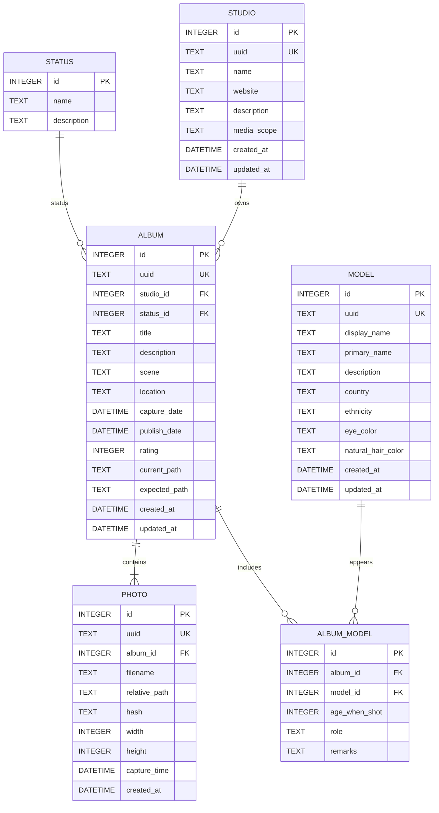

# Curator Database Model v0.1

## Design Principles

### Identity

Every business entity owns:

- id
- uuid

id is used by SQLite foreign keys.

uuid is used as the stable business identifier.

---

### Audit

Every mutable entity contains:

- created_at
- updated_at

---

### File System

Only Album stores file system paths.

Photo stores relative_path only.

---

### Relationship

Many-to-many relationships are represented by explicit relationship entities.

Example:

Album <-> Model

↓

Album_Model

instead of implicit mapping tables.

---

### Derived Data

Fields generated by AI or statistics should not become primary business data.

Examples:

album_count

photo_count

scene_summary

These may be recalculated.
