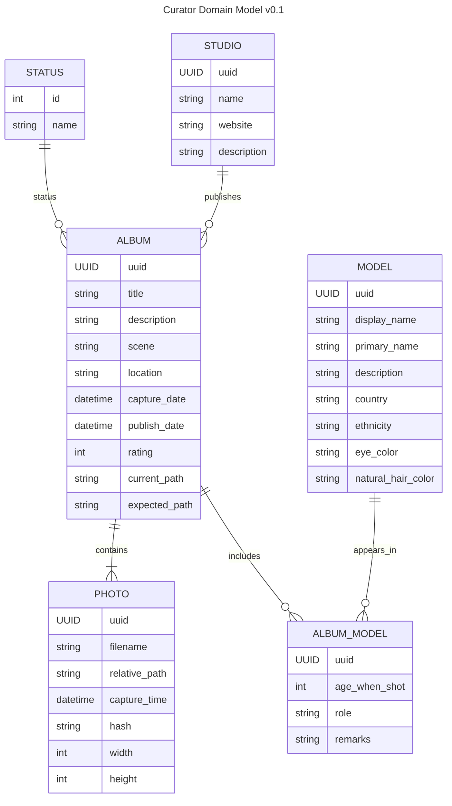

# Curator Domain Model

```mermaid
---
title: Curator Domain Model v0.1
---

erDiagram

    MODEL {
        UUID uuid
        string display_name
        string primary_name
        string description
        string country
        string ethnicity
        string eye_color
        string natural_hair_color
    }

    STUDIO {
        UUID uuid
        string name
        string website
        string description
    }

    STATUS {
        int id
        string name
    }

    ALBUM {
        UUID uuid
        string title
        string description
        string scene
        string location
        datetime capture_date
        datetime publish_date
        int rating
        string current_path
        string expected_path
    }

    PHOTO {
        UUID uuid
        string filename
        string relative_path
        datetime capture_time
        string hash
        int width
        int height
    }

    ALBUM_MODEL {
        UUID uuid
        int age_when_shot
        string role
        string remarks
    }

    ALBUM ||--|{ PHOTO : contains

    STUDIO ||--o{ ALBUM : publishes

    STATUS ||--o{ ALBUM : status

    MODEL ||--o{ ALBUM_MODEL : appears_in

    ALBUM ||--o{ ALBUM_MODEL : includes
```
