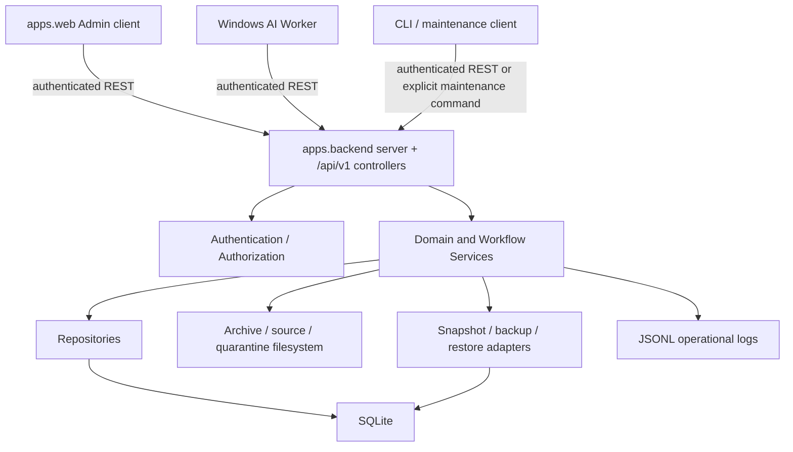

# Curator Backend Architecture

> Documentation status: Current
> Owner: Backend
> Last verified: 2026-08-11

## Purpose and scope

This is the as-built architecture of the active Curator Backend. It describes
component ownership and dependency direction. Observable workflow behavior
belongs to [Backend Specifications](Specifications/README.md); exact supported
entry points belong to [Supported Backend Surface](Supported-Backend-Surface.md);
physical persistence belongs to the [Database model](../Database/Curator_Database_Model.md).

## Current system boundary

`apps/backend` is the sole authoritative runnable Backend. It owns:

- SQLite connections, queries, transactions, schema compatibility and migrations;
- validation, authorization, business rules, workflow state transitions and concurrency;
- canonical filesystem paths, Import file actions, Repair, Quarantine and Restore;
- Snapshot creation, cleanup, protected database Restore and recovery evidence;
- Operation/Issue history and role-sensitive disclosure;
- static apps.web delivery and authenticated `/api/v1` transport;
- AI Workspace, Work Dispatch, controlled Photo evidence, result validation,
  Admin review, rework, Promotion, closure and retention.

`apps/web`, the Windows AI Worker, CLI clients, and future native clients are
out-of-process clients. They use REST and never open `Curator.db`, invoke
Repositories, or call Services in-process.

## Architecture principles

- **Backend owns persistence.** Clients cannot bypass validation or transaction boundaries.
- **Services own meaning.** Business rules and multi-resource coordination do not live in HTTP or SQL callers.
- **Repositories own persisted access.** SQL and SQLite row mechanics stay behind Repository methods.
- **Controllers translate HTTP.** They parse/authenticate requests, call Services, and serialize stable envelopes.
- **Hard constraints and Service rules cooperate.** SQLite prevents race-safe invalid states; Services explain intent and errors.
- **REST is the external boundary.** `/api/v1` is the supported client API.
- **Local-first and recovery-oriented.** SQLite, filesystem truth, Snapshots,
  explicit previews, confirmation, Operations and Repair remain first-class.
- **Human-controlled AI.** Workers submit evidence-bound recommendations;
  only reviewed Promotion changes permanent Album business data.

## Current component map



Operational JSONL is secondary diagnostic evidence. Database Operation records
are the durable workflow history.

## Runtime and transport

The Backend uses Python's standard-library HTTP server and serves static files
owned by `apps/web`. Configuration selects database and managed filesystem
roots. The default bind is loopback; LAN exposure for the Worker is explicit and
must be restricted to the intended host/network.

All normal resources use authenticated `/api/v1`. Shared success/error
envelopes, filters, pagination, request IDs, role/scopes, and disclosure are
controlled by API Specifications. The special first-Admin bootstrap is
loopback-only, one-time, and begins with an explicit terminal-generated Code.

`tools/web_ui/server.py` is only a compatibility launcher delegating to the
active Backend. `workspace/curator_base_app` is historical, refuses to start,
and its pre-versioned routes are not supported behavior.

## Application/Service layer

Services own use cases rather than tables. Current service responsibilities include:

- permanent Status, Model, Studio, Album, Model relationship, Album relationship and Photo rules;
- Album search/filter/batch preview and execution;
- direct Import preview, signed identity, COPY/MOVE/DATABASE_ONLY execution and failure truth;
- Operation history, Issue review, Repair policy/suppression and verification;
- Quarantine/item Restore, Snapshot administration and protected database Restore;
- device registration, first Admin, Token issue/renew/elevate/revoke and last-Admin safety;
- AI Dataset/Workspace and llama.cpp model-configuration management;
- Work Dispatch candidate preview, atomic Batch/Group/Reservation/Item creation,
  closure, release and redispatch;
- Worker claims/leases/attempts, Photo sampling/Manifest/transfer, two-stage results;
- Admin review/evaluation/rework, unique Album-name Promotion and retention.

Service transactions are bounded around durable invariants. Filesystem and
database changes cannot be made one transaction, so workflows specify action
order, verification, Snapshot policy, truthful partial-failure state, and Repair.

## Repository layer

`apps/backend/repositories.py` contains focused Repository classes for catalog,
authentication, operations/recovery, Dispatch, and AI Workspace domains.
Repositories translate between application records and SQLite; they expose
purpose-specific reads and writes rather than unrestricted query execution.

Services do not depend on HTTP request objects or SQLite rows. Controllers do
not execute SQL. Some current Services and composition remain in large modules;
this is implementation shape, not permission to cross the dependency boundary.

Repositories currently also contain defensive schema creation/upgrade for
Authentication and several workflow tables. Versioned AI schema exists in
migrations, while the base database is assumed. This split authority is
documented in [Schema Source of Truth](../Database/Schema-Source-of-Truth.md)
and is owned for consolidation by BT-059.

## Database and migrations

SQLite is the current and only implemented persistence engine. Connections
enable FK behavior and Repository methods own SQL/row translation. Integer IDs
serve local FK efficiency; UUIDs are stable external/business identities where
defined by the contract.

The migration runner creates verified pre-write backups and records
`schema_migration`, but today its default module handles only `0001`; MT-008 has
a separate guarded archive command and AI migrations are versioned SQL exercised
by tests. The project must not claim empty-database reconstruction until BT-059
implements and proves it.

PostgreSQL is future architecture only. Current code should preserve Service
meaning outside SQL, but no unused cross-engine abstraction is required.

## Catalog, filesystem, and recovery

Album stores the canonical managed path. Backend canonicalization detects
equivalent, conflicting, trailing-space, case, and Unicode path conditions.
Ordinary clients cannot submit arbitrary managed output paths.

Import, Repair, Quarantine and Restore coordinate SQLite with real filesystem
state. A failed verification creates truthful Operation/Issue/Repair evidence.
Repair only performs automatic rename for narrowly proven canonicalization-only
cases; fuzzy similarity is not authoritative evidence.

Snapshot policy is risk-based. Bulk/destructive/recovery actions use reviewed
preview, authorization, Snapshot and confirmation rules defined by their
Specifications. Protected database Restore creates a protective Snapshot,
invalidates stale session assumptions, and never reports success before the
restored database is verified.

Repair Quarantine is operational safety, not Digital Asset Trash. Trash and
permanent purge remain blocked in BT-033–035 and UI-010E.

## Work Dispatch and AI Workspace

Album business Status does not encode Worker assignment. Work Dispatch uses:

- Batch for one Admin-confirmed selection;
- Group for one Album assignment and retained history;
- Reservation as the one active Album lock across all Worker kinds;
- polymorphic Group Item link to adapter-owned Work Items;
- Closure plus release to retain evidence while making Album eligible again.

The Album AI adapter creates multiple Work Items in one Group when comparing
model configurations. The Worker receives only leased work and Manifest-bound
Photo evidence. Vision and Writer payloads are schema-validated and stored as
immutable stages. Review state is independent from run state. Rework creates a
successor Item; Promotion separately applies one approved name with race-safe
uniqueness. Closure/archive retain configurations, evidence, results, decisions,
Promotion and Operations indefinitely.

The retired `workspace_album` table is not the parent model for this workflow
and has no active client route.

## Authentication and authorization

Device registration and bearer Tokens represent approved client identity.
Tokens carry scopes, expire, can be renewed/elevated through Admin review, and
can be revoked. Plaintext credentials are disclosed only at issuance and are
stored as one-way hashes. The Backend enforces authorization even when the UI
hides an action. Final usable Admin Token safety prevents administrative lockout.

Role-sensitive API projections prevent Reader/Writer clients from receiving
Admin recovery or sensitive diagnostic fields. Redaction applies to network
payloads, rendered UI, artifacts and operational logs.

## Request flows

### Ordinary authenticated request

```text
Client → HTTP parse/request ID → authenticate and authorize
       → Service validation/use case → Repository transaction or read
       → optional filesystem/recovery adapter → Operation/log update
       → role-appropriate response envelope
```

### Reviewed mutation

```text
Client requests preview → Backend validates current truth, writes nothing
Client confirms signed preview → Backend authenticates and claims preview
Service revalidates → transaction/filesystem action/Snapshot as specified
Backend verifies durable + filesystem outcome → truthful Operation/response
```

### AI Worker request

```text
Worker Token → claim/lease Work Item → fetch only Manifest evidence
→ submit Vision → submit Writer → result ready for Admin review
```

## Testing and readiness

Backend tests are layered across unit, Repository, Service, API and disposable
workflow acceptance. `workflow-readiness` proves representative cross-resource
behavior; full regression protects the supported surface. Browser acceptance
complements rather than replaces Backend authority. Tests never use the live
database or managed production paths.

## Current architectural gaps and approved future direction

| Area | Status |
| --- | --- |
| Canonical empty-database bootstrap and ordered migration runner | Proposed BT-059 |
| Digital Asset Trash and irreversible purge | Specification Ready/implementation Blocked: BT-033–035, UI-010E |
| macOS native Photo curation application | Memo only |
| PostgreSQL implementation | Future only; no current task |
| Storage/presentation decoupling beyond canonical Album paths | Future product/architecture discussion only |

Future native curation may introduce user-organized collections and Photo-level
Trash while preserving Backend database ownership. It must receive its own
Architecture, Specifications and Tasks before affecting current schema or APIs.

## Change rule

Architecture changes update this document or an accepted ADR before lower-layer
implementation. Behavioral changes update Specifications. Schema changes update
the declared schema source, Catalog, diagrams and persistence maps. Implementation
gaps receive the owning BT/UI/MT task; DOC work does not silently change runtime behavior.

