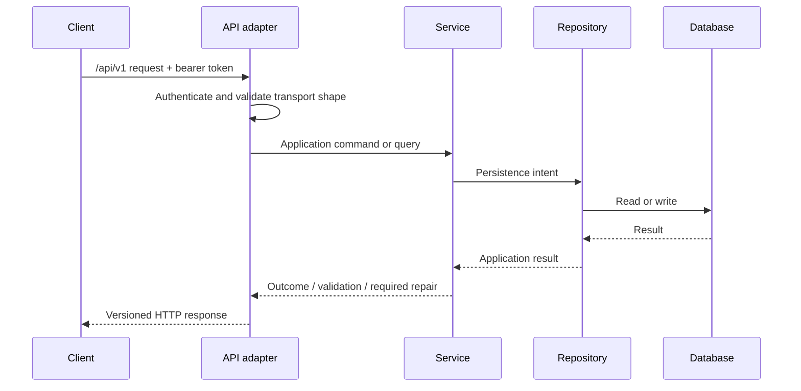

# API Specification

## Purpose and scope

This Specification defines the external HTTP contract for Curator Backend application capabilities. It applies to the Web UI, Windows AI Worker, CLI tools, and future out-of-process clients.

It does not define route-by-route resources, payload fields, HTTP-library behavior, or framework implementation. Those additions require a compatible extension to this Specification. The shared response envelope, error mapping, pagination, filtering, sorting, metadata, and authentication policy are authoritative in [API Contract](API-Contract.md).

## Architectural decisions inherited

- All external routes are under `/api/v1`.
- Clients use the API; they do not access the database, repositories, or Services directly.
- The AI Worker always uses HTTP REST and an `Authorization: Bearer <token>` credential.
- Controllers are adapters: they translate HTTP to Service operations and Service outcomes to HTTP; they do not own business rules or SQL.

## Responsibilities

| Actor | Responsibility |
| --- | --- |
| Client | Supplies valid credentials, request data, and explicit confirmation where a workflow requires it. |
| API adapter | Authenticates, authorizes, validates transport shape, invokes the relevant Service, and returns a stable response. |
| Service | Validates business meaning, performs or rejects the operation, and returns the outcome. |
| Repository / database | Persists and retrieves data only through Backend-controlled operations. |

## Request contract

Every request must provide:

- a `/api/v1` route and supported HTTP method;
- a bearer token unless the route is explicitly defined as local-only or unauthenticated health information;
- a request body matching the resource-specific contract when a body is required;
- only client-supplied identifiers that are permitted by the relevant workflow;
- an explicit confirmation value when a Specification marks an action as confirmation-required.

The API adapter validates JSON syntax, route/query types, pagination bounds, and required transport fields. It delegates domain validation—including paths, relationships, lifecycle permissions, and repair decisions—to Services.

## Response and error contract

Every response must communicate whether the requested operation succeeded, failed validation, conflicted with current state, was unauthorized, or requires a user decision. A response for a material write must make its Operation identifier available when an Operation record is required. [API Contract](API-Contract.md) defines the canonical response and error envelopes, error codes, status mapping, confirmation and repair outcomes, and the placement of operation and snapshot metadata.

## Request flow

## Validation and error handling

| Condition | Required behavior |
| --- | --- |
| Invalid JSON or transport shape | Reject before Service invocation; report a request-validation error. |
| Missing, expired, revoked, or invalid token | Reject without invoking the protected Service operation. |
| Token lacks required scope | Reject without performing the operation. |
| Business validation failure | Service rejects without applying the requested business change. |
| Concurrent uniqueness or integrity conflict | Do not claim success; return a conflict outcome and preserve the database invariant. |
| Filesystem work requires repair | Return the workflow outcome with its Operation identifier and repair state; do not represent it as a completed success. |
| Unexpected failure | Do not expose internal implementation details; create/complete an Operation record when applicable and return a stable failure outcome. |

## Pagination and read models

Collection responses that require filtering, sorting, aggregation, or pagination may return Repository read models. The API exposes such models as stable display/query results, not as a promise that clients may infer underlying tables. [API Contract](API-Contract.md) defines cursor pagination, list metadata, and filtering/sorting syntax.

## Operation and snapshot requirements

The API adapter does not independently decide snapshots. It exposes the Service outcome, including any Operation identifier, snapshot reference, pending repair, or required confirmation. Services apply the policies in the Operation Logging, Snapshot, Repair, and Import Specifications.

`GET /api/v1/operations` is a standard collection endpoint. It accepts
`status`, `operation_type`, inclusive ISO-8601 `started_from` and `started_to`,
`limit` from 1 through 100, and an opaque `cursor`. Results use stable newest-
first keyset pagination. A cursor is valid only with the same normalized
filters that created it; malformed or mismatched cursors return
`400 REQUEST_INVALID`. The response `data` is the Operation array and `meta`
contains pagination, active filters, and sort details. Every item is projected
according to the authenticated principal's diagnostic-disclosure role.

Issue and Repair review is exposed through authenticated `/api/v1/issues` and
`/api/v1/repairs` collection/detail routes. Each detail contains the actions
currently allowed for the caller's role and durable state. Decisions are
submitted to `/{uuid}/decisions` with an action and the exact
`expected_updated_at` returned by review. A changed or repeated decision is
rejected with `409 WORKFLOW_STALE` or `409 INVALID_TRANSITION`; clients never
construct a transition that the read model did not permit. Writer/Admin may
perform ordinary workflow decisions; ownership, Issue resolution/archive, and
bounded repair suppression remain Admin-only. Accepted decisions return their
durable Operation identifier. Reader projections omit repair paths,
confirmation, failure evidence, and verification detail.

Repair Quarantine is exposed only to Admin principals through
`/api/v1/quarantine-items` and signed `/api/v1/quarantine/preview|execute`
routes. Quarantine preview derives the candidate path from the reviewed Repair;
restore preview derives the destination from the item's retained original path.
Clients cannot submit arbitrary filesystem paths. The short-lived preview binds
configuration, directory inventory fingerprint, Repair/Item version, and target
occupancy and is claimed once. Stale, replayed, missing, occupied, or invalid
previews return structured conflicts before filesystem mutation.

Authentication administration uses the Admin-only
`/api/v1/auth/admin/state` read model and explicit registration, renewal, and
Token decision routes. State contains registration/renewal lifecycle and Token
metadata only. Approval responses may contain one newly generated Token once;
later reads never contain plaintext or hashes. Approval cannot exceed requested
authorization, and final-usable-Admin revocation returns
`409 LAST_USABLE_ADMIN` before mutation.

## Album management contracts

`GET /api/v1/albums` supports composable `q`, `studio_id`, `status_id`,
`model_id`, `rating_min`, `rating_max`, `capture_date_from`, `capture_date_to`,
`publish_date_from`, `publish_date_to`, `sort`, `limit`, and `offset` query
parameters. Dates use `YYYY-MM-DD`; an invalid or inverted range is a `400`
request error. Free-text search covers Album title and description, Studio,
location, scene, and linked Model display/primary names.

Album create/update accepts Album fields plus complete `models` and `relations`
sets at the service transaction boundary. Relationship target identifiers must
exist. A Model may occur once per Album, an Album cannot relate to itself, and
each `(related_album_id, relation_type)` pair is unique within the Album.
Malformed or missing targets return structured `400`; duplicate and self
relationships return structured `409`. Persistence integrity failures must not
be exposed as generic `500` errors.

`POST /api/v1/albums/batch/preview` accepts `ids`, `changes`, and an explicit
`overwrite_non_empty` policy. Supported changes are Studio, Status, rating,
description, scene, location, capture/publish dates, and remark. Preview is a
zero-write operation returning per-Album consequences, aggregate eligibility,
and a signed, short-lived `preview_token` bound to Album versions and the
reviewed overwrite policy.

`POST /api/v1/albums/batch/execute` accepts only that `preview_token`. It
atomically rejects expired, invalid, replayed-after-change, or stale previews
with `409`; it never partially applies the batch. Success returns per-Album
outcomes, an aggregate summary, and the durable batch Operation identifier.

## Import preview and execution contracts

`POST /api/v1/import/preview` requires non-empty `items` and one explicit
`import_action`: `COPY`, `MOVE`, or `DATABASE_ONLY`. It returns normalized
per-item validation and consequences plus a signed, short-lived
`preview_token` when at least one item is importable. The token binds the
importable reviewed items, action, configured roots/defaults, canonical
destinations, and source-state fingerprints. Preview performs no production
write, Snapshot, Operation creation, or filesystem mutation.

`POST /api/v1/import/execute` accepts only `preview_token`; client-supplied
items or replacement action are not execution inputs. Invalid signature,
expiry, changed source/configuration, new database/filesystem collision, and
replay return a structured `409` before production mutation. The first valid
request atomically claims the Preview. After the claim, per-item execution,
Operation outcome, and `NeedsRepair` behavior follow the Import Workflow.

## Future extensions

- Route/resource catalogs can be added without changing the shared contract.
- Stronger transport protections may be required if deployment expands beyond the trusted LAN assumptions.
