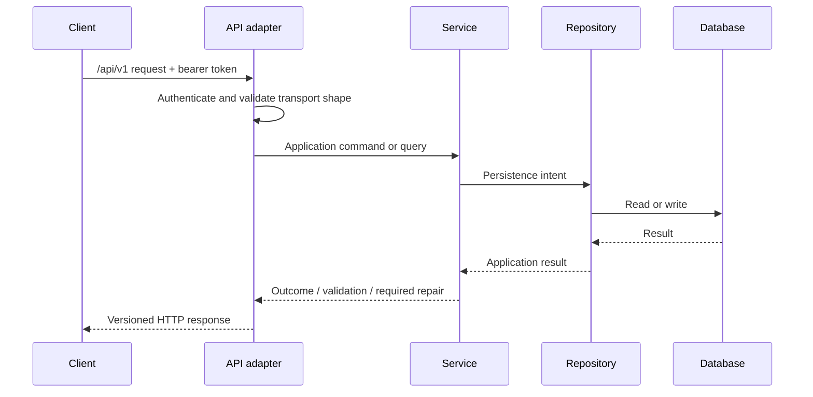

# API Specification

## Purpose and scope

This Specification defines the external HTTP contract for Curator Backend application capabilities. It applies to the Web UI, Windows AI Worker, CLI tools, and future out-of-process clients.

It does not define route-by-route resources, payload fields, HTTP-library behavior, or framework implementation. Those additions require a compatible extension to this Specification. The shared response envelope, error mapping, pagination, filtering, sorting, metadata, and authentication policy are authoritative in [API Contract](API-Contract.md).

## Architectural decisions inherited

- All external routes are under `/api/v1`.
- Clients use the API; they do not access the database, repositories, or Services directly.
- The AI Worker always uses HTTP REST and an `Authorization: Bearer <token>` credential.
- Controllers are adapters: they translate HTTP to Service operations and Service outcomes to HTTP; they do not own business rules or SQL.

## Responsibilities

| Actor | Responsibility |
| --- | --- |
| Client | Supplies valid credentials, request data, and explicit confirmation where a workflow requires it. |
| API adapter | Authenticates, authorizes, validates transport shape, invokes the relevant Service, and returns a stable response. |
| Service | Validates business meaning, performs or rejects the operation, and returns the outcome. |
| Repository / database | Persists and retrieves data only through Backend-controlled operations. |

## Request contract

Every request must provide:

- a `/api/v1` route and supported HTTP method;
- a bearer token unless the route is explicitly defined as local-only or unauthenticated health information;
- a request body matching the resource-specific contract when a body is required;
- only client-supplied identifiers that are permitted by the relevant workflow;
- an explicit confirmation value when a Specification marks an action as confirmation-required.

The API adapter validates JSON syntax, route/query types, pagination bounds, and required transport fields. It delegates domain validation—including paths, relationships, lifecycle permissions, and repair decisions—to Services.

## Response and error contract

Every response must communicate whether the requested operation succeeded, failed validation, conflicted with current state, was unauthorized, or requires a user decision. A response for a material write must make its Operation identifier available when an Operation record is required. [API Contract](API-Contract.md) defines the canonical response and error envelopes, error codes, status mapping, confirmation and repair outcomes, and the placement of operation and snapshot metadata.

## Request flow

## Validation and error handling

| Condition | Required behavior |
| --- | --- |
| Invalid JSON or transport shape | Reject before Service invocation; report a request-validation error. |
| Missing, expired, revoked, or invalid token | Reject without invoking the protected Service operation. |
| Token lacks required scope | Reject without performing the operation. |
| Business validation failure | Service rejects without applying the requested business change. |
| Concurrent uniqueness or integrity conflict | Do not claim success; return a conflict outcome and preserve the database invariant. |
| Filesystem work requires repair | Return the workflow outcome with its Operation identifier and repair state; do not represent it as a completed success. |
| Unexpected failure | Do not expose internal implementation details; create/complete an Operation record when applicable and return a stable failure outcome. |

## Pagination and read models

Collection responses that require filtering, sorting, aggregation, or pagination may return Repository read models. The API exposes such models as stable display/query results, not as a promise that clients may infer underlying tables. [API Contract](API-Contract.md) defines cursor pagination, list metadata, and filtering/sorting syntax.

## Operation and snapshot requirements

The API adapter does not independently decide snapshots. It exposes the Service outcome, including any Operation identifier, snapshot reference, pending repair, or required confirmation. Services apply the policies in the Operation Logging, Snapshot, Repair, and Import Specifications.

`GET /api/v1/operations` is a standard collection endpoint. It accepts
`status`, `operation_type`, inclusive ISO-8601 `started_from` and `started_to`,
`limit` from 1 through 100, and an opaque `cursor`. Results use stable newest-
first keyset pagination. A cursor is valid only with the same normalized
filters that created it; malformed or mismatched cursors return
`400 REQUEST_INVALID`. The response `data` is the Operation array and `meta`
contains pagination, active filters, and sort details. Every item is projected
according to the authenticated principal's diagnostic-disclosure role.

Issue and Repair review is exposed through authenticated `/api/v1/issues` and
`/api/v1/repairs` collection/detail routes. Each detail contains the actions
currently allowed for the caller's role and durable state. Decisions are
submitted to `/{uuid}/decisions` with an action and the exact
`expected_updated_at` returned by review. A changed or repeated decision is
rejected with `409 WORKFLOW_STALE` or `409 INVALID_TRANSITION`; clients never
construct a transition that the read model did not permit. Writer/Admin may
perform ordinary workflow decisions; ownership, Issue resolution/archive, and
bounded repair suppression remain Admin-only. Accepted decisions return their
durable Operation identifier. Reader projections omit repair paths,
confirmation, failure evidence, and verification detail.

Repair Quarantine is exposed only to Admin principals through
`/api/v1/quarantine-items` and signed `/api/v1/quarantine/preview|execute`
routes. Quarantine preview derives the candidate path from the reviewed Repair;
restore preview derives the destination from the item's retained original path.
Clients cannot submit arbitrary filesystem paths. The short-lived preview binds
configuration, directory inventory fingerprint, Repair/Item version, and target
occupancy and is claimed once. Stale, replayed, missing, occupied, or invalid
previews return structured conflicts before filesystem mutation.

Authentication administration uses the Admin-only
`/api/v1/auth/admin/state` read model and explicit registration, renewal, and
Token decision routes. State contains registration/renewal lifecycle and Token
metadata only. Approval responses may contain one newly generated Token once;
later reads never contain plaintext or hashes. Approval cannot exceed requested
authorization, and final-usable-Admin revocation returns
`409 LAST_USABLE_ADMIN` before mutation.

## Album management contracts

`GET /api/v1/albums` supports composable `q`, `studio_id`, `status_id`,
`model_id`, `rating_min`, `rating_max`, `capture_date_from`, `capture_date_to`,
`publish_date_from`, `publish_date_to`, `sort`, `limit`, and `offset` query
parameters. Dates use `YYYY-MM-DD`; an invalid or inverted range is a `400`
request error. Free-text search covers Album title and description, Studio,
location, scene, and linked Model display/primary names.

The normal Album collection, count, search, ordinary selectors, and editable
detail contract include only `catalog_state = ACTIVE`. `status_id` remains an
independent Album business field and is never interpreted as Trash or asset
availability. An ordinary detail request for a Trashed Album returns a stable
not-active outcome and, for an authorized Admin, may include a safe link to its
Trash or deleted-asset history projection.

Album create/update accepts Album fields plus complete `models` and `relations`
sets at the service transaction boundary. Relationship target identifiers must
exist. A Model may occur once per Album, an Album cannot relate to itself, and
each `(related_album_id, relation_type)` pair is unique within the Album.
Malformed or missing targets return structured `400`; duplicate and self
relationships return structured `409`. Persistence integrity failures must not
be exposed as generic `500` errors.

`POST /api/v1/albums/batch/preview` accepts `ids`, `changes`, and an explicit
`overwrite_non_empty` policy. Supported changes are Studio, Status, rating,
description, scene, location, capture/publish dates, and remark. Preview is a
zero-write operation returning per-Album consequences, aggregate eligibility,
and a signed, short-lived `preview_token` bound to Album versions and the
reviewed overwrite policy.

`POST /api/v1/albums/batch/execute` accepts only that `preview_token`. It
atomically rejects expired, invalid, replayed-after-change, or stale previews
with `409`; it never partially applies the batch. Success returns per-Album
outcomes, an aggregate summary, and the durable batch Operation identifier.

### Digital Asset Trash contracts

The controlling state, eligibility, retention, and evidence rules are defined
by [Digital Asset Trash](Digital-Asset-Trash.md). The API exposes Backend-owned
policy rather than accepting paths or client-calculated transitions.

`POST /api/v1/albums/{uuid}/trash/preview` is available to Writer and Admin. It
returns `can_trash`, stable blockers with authorized workflow links, lifecycle
version, reviewed Album/Photo count and bytes, retention consequence, warnings,
and a signed short-lived token when eligible. Preview performs no lifecycle,
filesystem, Snapshot, or Operation mutation.

`POST /api/v1/albums/trash/execute` accepts only that token. It is single-use,
revalidates all workflow and filesystem state, and returns the durable
Operation and verified lifecycle outcome. The normal Album read model excludes
the Album only after the Backend has durably accepted the lifecycle transition;
an incomplete material outcome is `NeedsRepair`, never success.

Admin-only `/api/v1/admin/digital-asset-trash` collection/detail routes expose
recoverable Trash, holds, retention, Missing/NeedsRepair outcomes, and deleted-
asset history. Admin-only restore, hold, hold-release, and purge Preview/Execute
routes use signed, expiring, single-use tokens bound to lifecycle version,
Backend-resolved paths, inventory fingerprints, destination occupancy, policy,
and authenticated principal. Execution accepts no replacement path or scope.

Successful restore returns the same Album/Photo identities as Active/Present.
Successful purge returns them as Trashed/Deleted with
`assets_available: false`; it never deletes catalog rows. Stable conflicts and
replay behavior use the error vocabulary in Digital Asset Trash.

`DELETE /api/v1/albums/{id|uuid}` is not a supported Album lifecycle operation.
It returns `409 ALBUM_HARD_DELETE_UNAVAILABLE` with no catalog or filesystem
mutation. Relationship-removal endpoints retain their narrower meanings.

## Import preview and execution contracts

`POST /api/v1/import/preview` requires non-empty `items` and one explicit
`import_action`: `COPY`, `MOVE`, or `DATABASE_ONLY`. It returns normalized
per-item validation and consequences plus a signed, short-lived
`preview_token` when at least one item is importable. The token binds the
importable reviewed items, action, configured roots/defaults, canonical
destinations, and source-state fingerprints. Preview performs no production
write, Snapshot, Operation creation, or filesystem mutation.

`POST /api/v1/import/execute` accepts only `preview_token`; client-supplied
items or replacement action are not execution inputs. Invalid signature,
expiry, changed source/configuration, new database/filesystem collision, and
replay return a structured `409` before production mutation. The first valid
request atomically claims the Preview. After the claim, per-item execution,
Operation outcome, and `NeedsRepair` behavior follow the Import Workflow.

## Work dispatch contracts

Admin-only Album dispatch APIs expose candidate, active, and historical views.
The candidate query composes the normal Album filters with `worker_kind` and
reservation/work summaries; its default projection excludes Albums with an
active Album Work Reservation. Eligibility and permitted actions are Backend
results, not client-derived rules.

`POST /api/v1/work-dispatch/preview` accepts an explicit bounded Album selection
or normalized first-`N` filter selection, one Worker kind, and its required
Workspace/configuration inputs. It performs no write and returns per-Album
eligibility, warnings, Group/Work Item counts, and a signed short-lived token.

`POST /api/v1/work-dispatch/execute` accepts only the preview token. It is
single-use and atomically creates the Batch, one exclusive reservation and
Group per Album, dataset-specific Work Items, and Operation. Any stale input or
reservation race returns structured `409` with no partial creation and no Album
Status mutation.

Admin Group cancellation/release endpoints require the current Group version
and an explicit reason. Release is rejected while execution, review, rework, or
Promotion remains active. Read models expose the links needed to move between
candidate, active-work, history, Workspace review, and Operation detail views.

`GET /api/v1/work-dispatch/worker-kinds` returns the Backend adapter catalog.
`GET /api/v1/work-dispatch/groups` accepts `view=active|review|closure|history|all`, optional
`workspace_uuid`, `worker_kind`, and `album_id`, plus bounded `limit`/`offset`.
Each row joins stable Album, Workspace, Batch, reservation, Work Item, review,
Promotion, and closure summaries and includes Backend-calculated permitted
actions. `active` contains unreleased Groups with Pending, Claimed, or Failed
Worker execution; `review` contains unreleased Groups with ReadyForReview,
InReview, or ReworkRequested obligations and no remaining Worker execution;
`closure` contains unreleased Groups with neither Worker nor open-review work,
including Approved, Rejected, and fully Cancelled outcomes that now require
Promotion, release, or closure; `history` contains Released Groups. Clients do not enumerate Albums
and request Group detail one row at a time.

`GET /api/v1/work-dispatch/groups/{group_uuid}` returns Group-wide obligations,
blockers, the successful Promotion winner, and permitted actions. Admin-only
`/release`, `/cancel`, and `/abandon` commands require `expected_version` and a
reason. Release requires all execution/review obligations terminal and one
winner when any Item is Approved. Cancel applies only before every Item's first
attempt. Abandon is explicit and cannot interrupt Pending or Claimed work.
Success atomically removes the reservation, retains every Batch/Group/Item and
AI artifact, records closure and Operation evidence, and never changes Album
Status. `GET /api/v1/work-dispatch/history?album_id=` exposes retained history.

`GET /api/v1/ai-workspaces/{uuid}/closure-preflight` reports every unreleased
Group or ungrouped Item and the calculated `Completed`, `Rejected`, `Cancelled`,
`Abandoned`, or `Mixed` outcome. Close requires an exact version and reason and
never cancels work or releases reservations itself. Archive requires a second
reason and retains `IndefiniteAudit` evidence. Closed/Archived Workspaces reject
new Items, evidence creation, result submission, review decisions, retries,
cancellation, and Promotion.

`GET /api/v1/ai-workspaces/{uuid}/overview` combines the retained Workspace,
Group/run/review/Promotion counts, closure preflight, and Backend-permitted
lifecycle actions. This is the Admin Workspace landing projection.

`GET /api/v1/ai-work-items/{uuid}/evidence-history` is Admin-only and never
erases or hides Manifest evidence when source files move or change. Each entry
reports `Available`, `Missing`, `Changed`, or `Unavailable`; degraded content
does not make the historical AI result or review unreadable.

Work Item evidence-manifest create/read endpoints select and expose immutable
relative metadata by Work Item identity. Admin may use them for orchestration
and audit; a Writer may use them only while the same Token owns the live Work
Item claim. The claimed Writer may ask the Backend to prepare the Manifest but
cannot nominate a path, file, or sample. Responses contain opaque evidence UUIDs
and relative evidence metadata, never the Album absolute path. Image content
transfer is specified separately.

`GET /api/v1/ai-evidence/{evidence_uuid}` returns redacted Manifest-bound
metadata; `/content` streams the signature-validated image with its fixed MIME,
bounded length, private no-store caching, and nosniff headers. Admin may read
content during Review and pending Promotion, but a successful Promotion retires
content transfer while metadata/history remain readable for audit. Writer access
requires that the same Token currently owns an unexpired claim on the evidence
Work Item. No route accepts a path parameter, creates a durable thumbnail, or
copies image bytes into the database or Web workspace.

`POST /api/v1/ai-work-items/{uuid}/regenerate-vision` is an Admin-only,
versioned recovery action for a Failed Work Item. It requires a reason,
preserves the predecessor and its immutable results, changes that predecessor
to Cancelled, and creates a Pending successor in the same Dispatch Group. The
successor starts at `AwaitingVision` with a new immutable Evidence Manifest.
Lineage is limited to three regenerations; Albums without additional eligible
images return `409 EVIDENCE_RESAMPLE_UNAVAILABLE`.

`POST /api/v1/ai-work-items/{work_item_uuid}/results/vision` and `/writer`
accept Writer-owned, versioned JSON results in that strict order. Both stages
are bound to the active claim, immutable evidence Manifest, and snapshotted AI
configuration. Vision uses `curator://album-analysis/vision/v1`; Writer uses
`curator://album-analysis/writer/v1` and contains exactly six unique, bounded
English Album-name suggestions: two 2-word names, two 3-word names, and two
4-word names. Exact retries are idempotent; a changed replay,
wrong stage, stale evidence, or expired/wrong claim returns structured `409`
without advancing review state. Accepted Writer output completes Worker
execution and makes the Work Item `ReadyForReview`—it does not change Album.

`GET /api/v1/ai-work-items/{work_item_uuid}/results` is Admin-only and returns
the immutable accepted payloads, runtime metrics, configuration and Manifest
bindings, submitter identity, Operations, and current result-review state.

`GET /api/v1/ai-reviews` and `/ai-work-items/{uuid}/review` expose the stable
Admin review queue/detail projection. The queue accepts optional `state`,
`workspace_uuid`, `album_id`, `configuration_uuid`, `group_uuid`, and bounded
text search, plus `limit`/`offset`. Detail includes the Album and configuration,
immutable result stages, current and historical evidence availability, decision
lineage, Promotion attempts, public Operation summaries, linked Issues, and
Backend-permitted review actions. Admin commands `/review/start` and
`/review/decision` require `expected_version`. The only transitions are
`ReadyForReview → InReview → Approved | Rejected | ReworkRequested`. Approval
freezes one Writer recommendation or validated human revision; Reject/Rework
require a reason. Rework creates a linked pending Work Item in the same Group
with the same configuration snapshot and preserves all prior evidence.

`POST /api/v1/ai-work-items/{uuid}/promotion/preview` is Admin-only and requires
an Approved frozen selection. It returns current/resulting Album title and
Status, `acknowledgement_required: true`, and a signed ten-minute token bound to
review, Album, Workspace, and Admin versions. `POST
/api/v1/ai-promotions/execute` accepts only that token and the literal JSON
boolean `acknowledged: true`; a missing, false, or malformed acknowledgement is
rejected without side effects. Execution is single-use and idempotent,
atomically records the unique Workspace/Album winner, Operation, title change,
and `TEMPORARY → NAME_GENERATED` policy; other Statuses are retained. Stale and
competing previews return structured `409` without an Album mutation. Failed
materialization retains `PromotionFailed` evidence.

`GET /api/v1/ai-work-items/{uuid}/promotion` is the read-only Promotion-history
projection. It remains available after release, Workspace close/archive, or
source-evidence degradation and does not issue or consume a mutation preview.
All projections are Admin-only and omit claim Tokens, absolute Album paths, and
sensitive Operation diagnostics.

## Capability-aware Work Item claim contract

`POST /api/v1/ai-work-items/claim` is a Writer-only outbound long-poll request.
Its request body requires `worker_kinds`, a non-empty array of 1–8 unique
registered Worker-kind strings; `lease_seconds`, an integer from 60 through
3600; and `wait_seconds`, an integer from 0 through 30. The declaration is
normalized in request order. Unknown, duplicate, or malformed kinds and invalid
bounds return `400 REQUEST_INVALID`. Zero wait performs an immediate claim.

Selection is atomic and considers only Work Items whose immutable
`worker_kind` is declared by the process, whose Workspace is Open, and whose
run state is Pending or has an expired claim lease. An incompatible older item
must not block a later compatible item. Success returns `200` with an already
owned `data.item`, including its required `worker_kind` and `result_state`.
An item without an accepted Vision result returns `AwaitingVision`. An item
retried after Vision succeeded returns `AwaitingWriter` and the exact normalized
immutable `accepted_vision` payload required to resume Writer without replaying
Vision. The recovery payload is claim-bound and contains no Token, path, or
Evidence bytes. A normal deadline
returns `200` with `data.item: null` and creates no attempt, Operation, or Work
Item mutation.

Every successful attempt retains an immutable JSON snapshot of the normalized
`worker_kinds` declaration. Device registration remains an authorization
identity only; a runtime declaration is not permanent Device configuration and
never adds permissions.

Dispatch commit is the wake-up boundary. The Backend may wake multiple
compatible waiters, but database transaction ownership remains authoritative.
Durable state is checked before sleeping and after wake or timeout, so
disconnect, notification loss, and Backend restart cannot lose, duplicate, or
transfer ownership. Workers expose no inbound callback, webhook, WebSocket, or
SSE endpoint.

## Future extensions

- Route/resource catalogs can be added without changing the shared contract.
- Stronger transport protections may be required if deployment expands beyond the trusted LAN assumptions.
