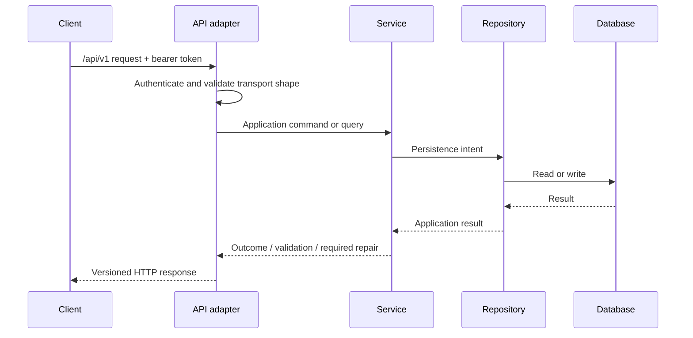

# API Specification

## Purpose and scope

This Specification defines the external HTTP contract for Curator Backend application capabilities. It applies to the Web UI, Windows AI Worker, CLI tools, and future out-of-process clients.

It does not define route-by-route resources, payload fields, HTTP-library behavior, or framework implementation. Those additions require a compatible extension to this Specification.

## Architectural decisions inherited

- All external routes are under `/api/v1`.
- Clients use the API; they do not access the database, repositories, or Services directly.
- The AI Worker always uses HTTP REST and an `Authorization: Bearer <token>` credential.
- Controllers are adapters: they translate HTTP to Service operations and Service outcomes to HTTP; they do not own business rules or SQL.

## Responsibilities

| Actor | Responsibility |
| --- | --- |
| Client | Supplies valid credentials, request data, and explicit confirmation where a workflow requires it. |
| API adapter | Authenticates, authorizes, validates transport shape, invokes the relevant Service, and returns a stable response. |
| Service | Validates business meaning, performs or rejects the operation, and returns the outcome. |
| Repository / database | Persists and retrieves data only through Backend-controlled operations. |

## Request contract

Every request must provide:

- a `/api/v1` route and supported HTTP method;
- a bearer token unless the route is explicitly defined as local-only or unauthenticated health information;
- a request body matching the resource-specific contract when a body is required;
- only client-supplied identifiers that are permitted by the relevant workflow;
- an explicit confirmation value when a Specification marks an action as confirmation-required.

The API adapter validates JSON syntax, route/query types, pagination bounds, and required transport fields. It delegates domain validation—including paths, relationships, lifecycle permissions, and repair decisions—to Services.

## Response and error contract

Every response must communicate whether the requested operation succeeded, failed validation, conflicted with current state, was unauthorized, or requires a user decision. A response for a material write must make its Operation identifier available when an Operation record is required.

The exact envelope field names, status-code mapping, metadata shape, pagination token/offset format, validation-error structure, conflict structure, and repair-response structure are unresolved and must be defined before implementation in this document.

## Request flow

## Validation and error handling

| Condition | Required behavior |
| --- | --- |
| Invalid JSON or transport shape | Reject before Service invocation; report a request-validation error. |
| Missing, expired, revoked, or invalid token | Reject without invoking the protected Service operation. |
| Token lacks required scope | Reject without performing the operation. |
| Business validation failure | Service rejects without applying the requested business change. |
| Concurrent uniqueness or integrity conflict | Do not claim success; return a conflict outcome and preserve the database invariant. |
| Filesystem work requires repair | Return the workflow outcome with its Operation identifier and repair state; do not represent it as a completed success. |
| Unexpected failure | Do not expose internal implementation details; create/complete an Operation record when applicable and return a stable failure outcome. |

## Pagination and read models

Collection responses that require filtering, sorting, aggregation, or pagination may return Repository read models. The API exposes such models as stable display/query results, not as a promise that clients may infer underlying tables.

## Operation and snapshot requirements

The API adapter does not independently decide snapshots. It exposes the Service outcome, including any Operation identifier, snapshot reference, pending repair, or required confirmation. Services apply the policies in the Operation Logging, Snapshot, Repair, and Import Specifications.

## Open Questions

- What is the exact standard success envelope and error envelope?
- Which HTTP status codes represent validation failure, conflict, authorization failure, `needs_repair`, and confirmation-required outcomes?
- How are filtering, sorting, pagination, and metadata represented consistently across list endpoints?
- Which routes, if any, are permitted without a bearer token while the Backend is bound only to loopback?

## Future extensions

- Route/resource catalogs can be added without changing the shared contract.
- Stronger transport protections may be required if deployment expands beyond the trusted LAN assumptions.
