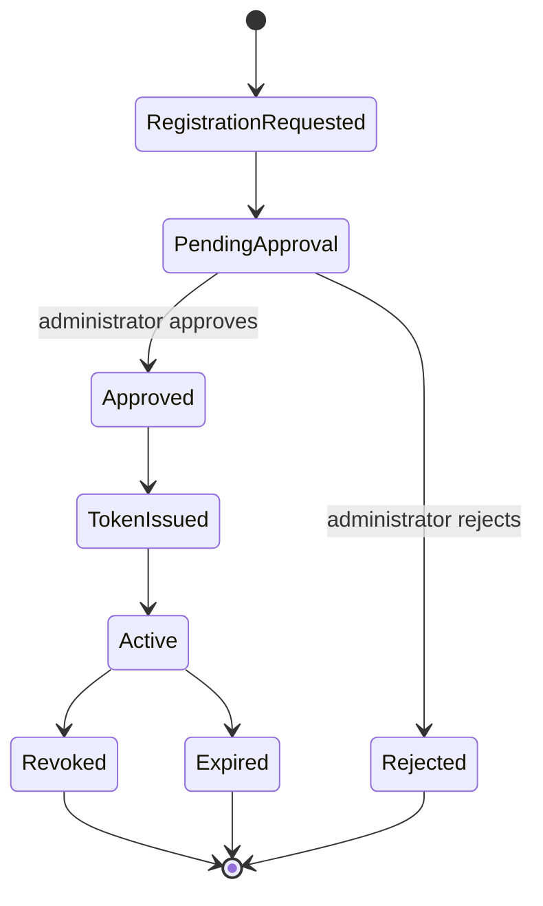

# Authentication Specification

## Purpose and scope

This Specification defines device access for Curator's trusted home-LAN model. Curator does not use username/password accounts. It uses approved device tokens for `/api/v1` access.

## Token contract

Clients authenticate with `Authorization: Bearer <token>`. The Backend stores only a token hash, never the plaintext token. Plaintext is displayed once at issuance; the client stores it in protected local configuration.

The persistent `auth_token` record includes at least a token UUID, token hash, device name, permission scope, creation time, expiration time, last-used time, and revocation state. Tokens normally have one-year validity and support renewal, revocation, and reissuance.

## Registration and approval workflow

1. A device requests registration.
2. The Backend creates a reviewable event or Issue.
3. An administrator approves or rejects through the server-side Web UI.
4. Approval permits one-time token issuance; the hash is persisted and the plaintext is shown once.
5. The client stores the token locally and uses it on subsequent requests.

LAN clients cannot self-register, self-approve, or issue tokens. Automatic approval is not part of the current phase. A local administrator command or loopback-only management endpoint may perform the same approved administrative action.

## Permission scopes

| Scope | Permitted capability |
| --- | --- |
| `admin` | Manage tokens, migrations, restores, backups, and other high-risk administration. |
| `writer` | Perform authorized data writes; cannot perform administrative operations. |
| `reader` | Perform read-only queries. |

The AI Worker normally receives a `writer` token only. Scope checking occurs before the protected Service operation runs.

## Access and error handling

- Missing, invalid, expired, revoked, or malformed credentials are rejected.
- A valid token without the required scope is rejected.
- Authentication failures do not invoke the protected Service operation.
- Token issuance, approval, revocation, and security-relevant failures are recorded as Operations and/or Issues according to their workflow requirements.
- The Backend binds to `127.0.0.1` by default. A LAN bind for the Windows AI Worker is explicit and paired with host-limited firewall rules.

## Open Questions

- What data and proof must a device provide in a registration request?
- What renewal workflow preserves least privilege while avoiding plaintext-token recovery?
- Which token-management actions require additional confirmation?
- What stronger transport protections are required if deployment extends beyond the trusted LAN?

## Future extensions

Automatic approval, account systems, and broader network deployment are not current requirements. Any such change requires an Architecture/ADR review before implementation.
