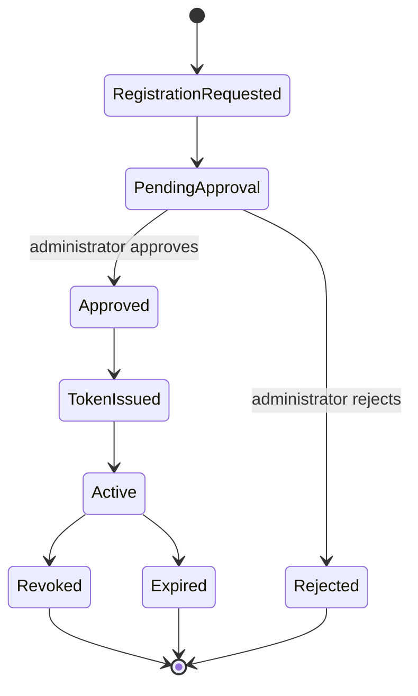

# Authentication Specification

## Purpose and scope

This Specification defines device access for Curator's trusted home-LAN model. Curator does not use username/password accounts. It uses approved device tokens for `/api/v1` access.

## Token contract

Clients authenticate with `Authorization: Bearer <token>`. The Backend stores only a token hash, never the plaintext token. Plaintext is displayed once at issuance; the client stores it in protected local configuration.

The persistent `auth_token` record includes at least a token UUID, token hash, device name, permission scope, creation time, expiration time, last-used time, and revocation state. Tokens normally have one-year validity and support renewal, revocation, and reissuance.

## Registration and approval workflow

1. A device requests registration.
2. The Backend creates a reviewable event or Issue.
3. An administrator approves or rejects through the server-side Web UI.
4. For browser enrollment, approval activates a Client-generated Token hash; only the requesting Client retains plaintext. Legacy/operator issuance may still show plaintext once.
5. The client stores the token locally and uses it on subsequent requests.

### Registration request policy

Curator's current deployment assumes a trusted home LAN and a very small set of trusted devices, initially including only the AI Server. Registration intentionally favors simple, administrator-controlled device access over enterprise identity infrastructure.

A registration request MUST contain only the information needed to identify the requesting device and describe the requested authorization:

| Field | Requirement |
| --- | --- |
| `device_name` | A human-readable identifier for administrator review. |
| `device_id` or `device_fingerprint` | A stable unique identifier used to distinguish the device. `device_name` alone MUST NOT be used as device identity. |
| `requested_role` | The requested role: `reader`, `writer`, or `admin`. |
| `requested_scopes` | Optional requested permissions within the requested role. |
| `registration_proof` | An Administrator-generated registration secret. Backend persists only its hash and reveals newly generated plaintext once. |
| `candidate_token_hash` | Optional hash of a high-entropy Device Token generated and retained by the requesting Client. |
| `enrollment_proof` | Independent high-entropy capability used only by the requesting Client to read its registration decision. |

The registration proof establishes that the request may be considered; it does not grant access by itself. A trusted-LAN Client may submit a proof-protected request when the operator explicitly enables LAN binding, but it cannot self-approve or issue an active token. Automatic approval is not part of the current phase. Only an authenticated Administrator performs the approval action.

After the first Administrator exists, authenticated Admin management MAY generate,
rotate, or disable the active Registration Proof. Rotation atomically invalidates
the previous proof and never changes existing approved Device Tokens. Plaintext is
returned only by the successful generate/rotate response; later reads expose safe
metadata only. Environment-provided registration secrets remain an operator fallback
during migration, but a managed active proof is the normal interactive workflow.

For browser enrollment, the requesting Client generates the Device Token locally and
submits only its hash. It also generates an independent enrollment proof whose hash is
persisted. Before approval the candidate Token cannot authenticate. Approval atomically
activates its hash with no Token plaintext in the Admin response. A decision-status read
requires the enrollment proof and reveals only that request's Pending, Approved,
Rejected, Expired, or Cancelled state. Registration UUID or device identity alone is
never an enrollment capability.

Certificates, PKI, mutual TLS, and hardware-backed device identities are intentionally outside the current phase.

## First administrator bootstrap

The normal approval workflow requires an existing administrator and therefore
cannot issue the first Admin Token. Initial installation uses a separate local
bootstrap trust boundary:

- the operator must control the Backend host console;
- bootstrap succeeds only before any trusted approved Admin registration has
  been established; Token expiry or revocation never reopens it;
- the first device is created directly as a trusted `admin` with the fixed
  `read`, `write`, and `admin` scopes;
- the Token plaintext is printed or returned exactly once, while only its hash
  is persisted;
- registration, Token issuance, and the security Operation are one truthful
  outcome; partial failure must not leave usable bootstrap credentials; and
- a repeated bootstrap request is rejected before authentication state changes.

The supported first phase is a local command. A loopback UI may use a
console-generated, short-lived, single-use Bootstrap Code as specified below,
but loopback source address alone never grants administrator authority.

A UI Bootstrap Code is generated only by an explicit local-console command. It
is random, stored only as a hash, valid for ten minutes, and invalidates any
previous unused Code. Completion requires both a loopback client address and
the Code. Five failed attempts lock that Code. Successful completion consumes
it and establishes the first Admin exactly once. Code values, failed inputs,
and issued Token plaintext are never written to Operations or logs.

After first bootstrap, registration approval, renewal approval, role elevation,
and Token revocation require an authenticated Admin Token. The earlier
loopback-only unauthenticated approval path is not a supported authorization
boundary and must not remain available alongside Admin management.

Loss of every usable Admin Token is not a new-installation condition. It must
not reopen bootstrap automatically or through an anonymous UI/API. Recovery
requires a separately specified, explicitly invoked offline administrator
recovery command and is outside the first-bootstrap tasks.

Authenticated Admin management exposes registration, renewal, and Token
metadata but never Token hashes, registration proof, or existing plaintext.
Approval may reduce a requested role or scope set but cannot exceed it; role
elevation therefore requires an explicit Admin-role registration request.
Registration and renewal rejection are durable decisions. Revocation performs
the usable-Admin count and Token update in one immediate transaction: the last
currently unexpired, trusted, approved Admin Token cannot be revoked. A newly
issued or renewed Token plaintext appears only in that successful approval
response and is absent from all subsequent reads.

## Current authorization model

Roles express the maximum authorization requested by a device, and scopes express the permissions granted to its token. The current role policy is deliberately small:

| Role | Permitted capability |
| --- | --- |
| `admin` | Manage tokens, migrations, database restores, backups, Digital Asset Trash restore/hold/purge, and other high-risk administration. |
| `writer` | Perform authorized data writes, including eligible recoverable Album Trash; cannot inspect or administer Trash or permanently purge assets. |
| `reader` | Perform read-only queries. |

`writer` is the highest role normal devices SHOULD request. `admin` privileges are reserved for administrator-controlled devices. The AI Worker normally receives a `writer` token only. Administrator approval is required before any registered device receives a long-lived token, including a token with a reduced role or scope. Scope checking occurs before the protected Service operation runs.

Digital Asset Trash authorization is action-specific. Writer and Admin may
preview and execute eligible Album Trash from entity management. Only Admin may
list/detail Trash, restore assets, manage holds, view deleted-asset history, or
preview/execute permanent asset purge. Authentication and scope failure occurs
before eligibility evaluation or filesystem work and produces no lifecycle
mutation.

Future versions MAY add richer role or scope management while preserving this role vocabulary and the bearer-token API contract.

## Token renewal and token handling

Tokens have an expiration time; the normal validity period is one year unless an administrator issues a shorter period. A device MAY request renewal before its current token expires. Renewal follows the same administrator-controlled policy as issuance:

1. The device submits a renewal request for its registered identity and current authorization.
2. The Backend records the request for administrator review.
3. An administrator approves or rejects the renewal.
4. After approval, the Backend issues a new token and makes its plaintext available once.
5. Once the new token is valid, the Backend revokes the previous token.

The Backend MUST store only token hashes and MUST reveal a token plaintext only at its initial issuance. It MUST NOT provide an API that retrieves or re-displays an existing token in plaintext. A device that cannot retain its token must use the registration or approved renewal/reissuance workflow; it cannot recover the original value.

The current deployment assumes a trusted LAN. No additional encrypted-token transport mechanism beyond applicable HTTPS requirements is required in this phase.

## Confirmation requirements

The following current-phase actions require administrator approval and no additional confirmation mechanism:

| Action | Required confirmation |
| --- | --- |
| New device registration | Administrator approval. |
| Normal token renewal | Administrator approval. |
| Role elevation | Administrator approval. |

These requirements do not change the general API confirmation contract. They specify the administrative approval required before the associated token-management action may complete.

## Access and error handling

- Missing, invalid, expired, revoked, or malformed credentials are rejected.
- A valid token without the required scope is rejected.
- Authentication failures do not invoke the protected Service operation.
- Token issuance, approval, revocation, and security-relevant failures are recorded as Operations and/or Issues according to their workflow requirements.
- The Backend binds to `127.0.0.1` by default. A LAN bind for the Windows AI Worker is explicit and paired with host-limited firewall rules.

## Future work and transport hardening roadmap

The following stages describe an evolutionary path. Only Stage A is a current requirement. Stage B and Stage C are planning guidance only and are intentionally outside the scope of the first implementation.

### Stage A — Current

- Trusted home LAN.
- Bearer-token authentication.
- Simple administrator approval for device registration, renewal, and role elevation.
- Minimal operational complexity.

### Stage B — Future

- HTTPS everywhere.
- Short-lived access tokens and a refresh workflow.
- Device revocation.
- Improved audit logging.

### Stage C — Long-term

Possible future improvements include device certificates, public-key-based device identity, stronger device authentication, and additional confirmation mechanisms.

QR-code confirmation, PIN-based confirmation, device-to-device approval, and multi-device administrator approval are future-work options only. They MUST NOT complicate the first implementation.

Automatic approval, account systems, and broader network deployment are also not current requirements. Any change to these decisions requires an Architecture/ADR review before implementation.

## Design philosophy

Authentication for Curator remains simple for a single-user trusted environment and avoids unnecessary operational complexity. Current requirements are deliberately separated from future capabilities so stronger mechanisms can be introduced later without changing the overall device-token authentication architecture. The objective is evolutionary architecture rather than premature complexity.
