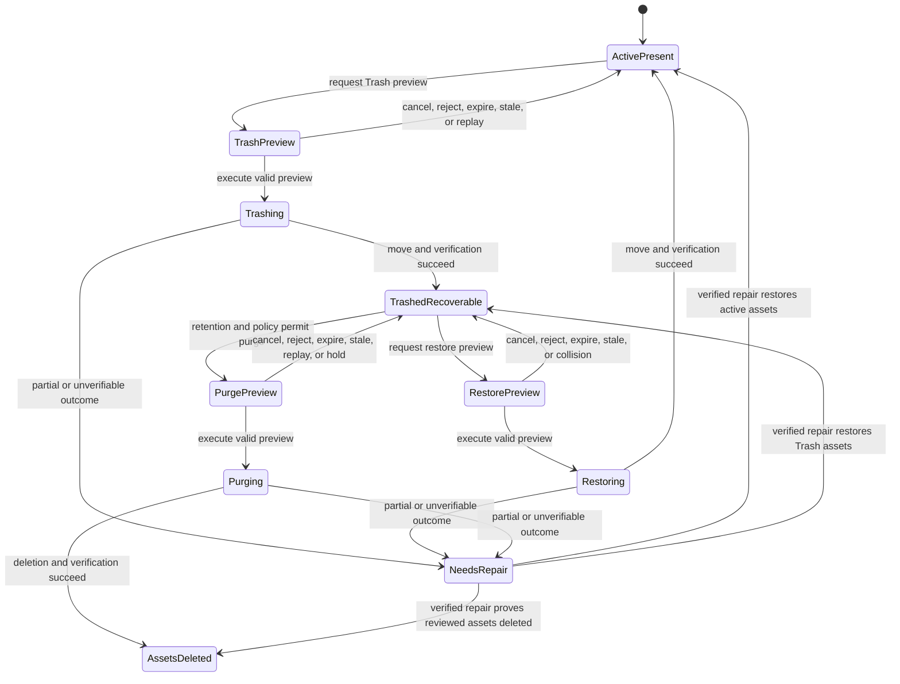

# Digital Asset Trash Specification

## Purpose and scope

This Specification defines Curator's authoritative lifecycle for removing an
Album or individual Photo from the active catalog, recovering its digital
assets, and permanently deleting those assets while retaining durable catalog
and workflow evidence.

Digital Asset Trash is a user-intended asset-removal lifecycle. It is distinct
from Repair Quarantine, which isolates unexpected filesystem conflicts, and
from database Snapshot Restore, which recovers database state.

`apps.web` uses Album as the minimum routine Trash unit. A future native client
may expose the Photo-level contract, but Photo-level Trash must never silently
Trash its owning Album.

## Architectural decisions

- Album, Photo, Album–Model, Album–Album, AI Work, Review, Promotion,
  Operation, Issue, Repair, and public UUID evidence is never physically
  deleted by Trash or permanent asset purge.
- Album business `status_id`, catalog visibility, and digital-asset lifecycle
  are independent dimensions. Trash and purge never overwrite `status_id`.
- Permanent purge means irreversible deletion of reviewed digital assets. It
  does not mean deletion of the catalog identity or historical evidence.
- Filesystem mutation is owned by Backend Services. Clients cannot supply an
  absolute source, Trash destination, restore destination, or purge path.
- Album Trash includes the Album directory and all contained Photos as one
  reviewed asset scope.
- Eligibility, legal transitions, retention, hold, idempotency, verification,
  and partial-failure handling are Backend policy. Clients display these
  decisions but never recreate them.
- The legacy database-hard-delete Album endpoint is not part of this lifecycle
  and must be unavailable before a Trash UI is enabled.

## Persistent lifecycle model

### Independent state dimensions

`album.status_id` retains its existing meaning as the Album's business/content
state, such as `TEMPORARY` or `NAME_GENERATED`.

Every Album and retained Photo asset has lifecycle state equivalent to:

| Dimension | Values | Meaning |
| --- | --- | --- |
| `catalog_state` | `ACTIVE`, `TRASHED` | Whether the record participates in the normal active-library read model. |
| `asset_state` | `PRESENT`, `TRASHED`, `DELETED`, `MISSING`, `NEEDS_REPAIR` | Verified availability and location class of its digital assets. |

The implementation may normalize Album- and Photo-level lifecycle persistence
into related tables, but API clients receive these stable meanings.

### Required retained evidence

Lifecycle persistence retains at least:

- Album and Photo stable IDs and UUIDs;
- current `catalog_state`, `asset_state`, and lifecycle version;
- Trash time, actor, Operation UUID, reviewed asset count and byte total;
- original managed-relative location and Backend-controlled Trash identity;
- retention deadline and hold state, reason, actor, and timestamps;
- restore time, actor, and Operation UUID when restored;
- purge time, actor, Operation UUID, reviewed asset count and byte total, and
  a manifest digest sufficient to identify the deleted scope without retaining
  file content;
- linked Issue/Repair identity and last verified outcome when degraded; and
- relationship, AI Work, Review, Promotion, and Operation references required
  to explain the Album's history.

Absolute paths are operational diagnostics. Public and Writer projections use
managed-relative or redacted descriptions; Admin access remains subject to the
diagnostic-disclosure policy.

### Legal stable combinations

| Catalog | Asset | Stable meaning |
| --- | --- | --- |
| `ACTIVE` | `PRESENT` | Normal active Album whose assets were verified at the owning operation boundary. |
| `ACTIVE` | `MISSING` | Active catalog record whose expected assets were not found; repair or rescan is required. |
| `ACTIVE` | `NEEDS_REPAIR` | Active visibility retained while an attempted asset transition or detected inconsistency requires repair. |
| `TRASHED` | `TRASHED` | Recoverable assets are held below the configured Trash root. |
| `TRASHED` | `DELETED` | Digital assets were permanently removed; historical database evidence remains. |
| `TRASHED` | `MISSING` | A Trashed record's expected assets cannot be found and require investigation. |
| `TRASHED` | `NEEDS_REPAIR` | Trash, restore, or purge produced an incomplete or unverifiable outcome. |

`TRASHED/PRESENT` may exist only as a bounded in-progress or crash-recovery
condition while a durable Operation is `Running` or `NeedsRepair`. It is never
reported as a completed Trash success. `ACTIVE/TRASHED` and `ACTIVE/DELETED`
are invalid stable combinations.

## Lifecycle state machine

Preview and execution workflow states belong to the Operation/read model; they
need not be persisted as additional Album state values.

## Album Trash eligibility

The Backend returns `can_trash`, the current lifecycle version, and zero or more
stable blockers. Trash is unavailable when any of the following applies:

| Blocker code | Condition |
| --- | --- |
| `ALBUM_NOT_ACTIVE` | `catalog_state` is not `ACTIVE`. |
| `ASSETS_NOT_PRESENT` | Assets are not in a verified state eligible for Trash. |
| `ACTIVE_WORK_RESERVATION` | An Album Work Reservation exists. |
| `WORK_GROUP_NOT_RELEASED` | Any related Dispatch Group remains unreleased. |
| `WORK_ITEM_NOT_TERMINAL` | A related Work Item is Pending, Claimed, retryable, or otherwise non-terminal. |
| `REVIEW_NOT_FINAL` | Review, rework, winner selection, or Promotion obligations remain. |
| `WORKSPACE_NOT_CLOSED` | A related owning Workspace remains Open; Closed or Archived is required. |
| `ACTIVE_OPERATION` | A material Operation currently owns or changes the Album/assets. |
| `ACTIVE_ISSUE_OR_REPAIR` | An unresolved Issue/Repair owns the same asset transition or filesystem discrepancy. |
| `LIFECYCLE_HELD` | A policy hold prevents the requested transition. |

Completed historical Work is not itself a blocker after its Group is Released,
its Review/Promotion obligations are final, and its Workspace is Closed or
Archived. Historical records remain linked after Trash and purge.

Eligibility is evaluated during preview and revalidated atomically when the
preview is claimed. A blocker returns a structured no-side-effect conflict with
safe links to affected Groups, Work Items, Reviews, Workspaces, Operations, or
Repairs when the caller may inspect them.

## Trash workflow

An authenticated Writer or Admin may request Album Trash from entity
management. The flow is Preview then Execute:

1. Preview resolves the Album and every contained Photo from Backend state,
   verifies eligibility, inventories the asset scope, and returns Album title,
   Photo count, byte total, retention consequence, warnings, blockers, and a
   signed short-lived token bound to caller, lifecycle version, configuration,
   inventory fingerprint, source state, and destination availability.
2. Preview performs no catalog, filesystem, Operation, Snapshot, or retention
   mutation.
3. Execute accepts only the preview token, claims it once, revalidates all bound
   state, creates the Operation, and moves the complete reviewed scope below a
   Backend-configured Trash root using a unique Trash identity.
4. The Backend verifies source absence, Trash destination identity and
   inventory, then commits `catalog_state = TRASHED` and
   `asset_state = TRASHED` with retained evidence.
5. Cancellation, invalid authorization, blocker, expiry, stale state, replay,
   collision, or pre-execution verification failure produces zero business and
   filesystem mutation.
6. A post-mutation failure is never success. It records `NeedsRepair`, retains
   observed recovery context, and creates or links the required Issue/Repair.

Normal Album collection/count/search and ordinary entity selectors exclude
`catalog_state = TRASHED`. Direct normal-detail access returns a stable
gone/not-active outcome with a safe Admin-history link when authorized; it must
not expose the record as editable active data.

## Restore workflow

Restore is Admin-only. Preview resolves the retained Trash identity and the
original Backend-managed destination, verifies the complete inventory, checks
that the destination is unoccupied and collision-free, and issues a signed,
single-use token bound to lifecycle version and filesystem fingerprints.

Execution moves the scope intact, verifies the destination and inventory, then
sets `catalog_state = ACTIVE` and `asset_state = PRESENT`. It preserves the
Album's `status_id`, IDs, UUIDs, relationships, AI history, and prior Trash/
restore Operations. Restore never overwrites an occupied destination. Stale,
replayed, missing, held, or colliding requests have zero side effects; partial
outcomes enter `NEEDS_REPAIR`.

## Retention and hold

Recoverable Trash has a default 30-day retention period beginning at verified
Trash completion. Deployment configuration may lengthen this period but may
not silently shorten an already assigned deadline.

Only Admin may create, extend, or release a hold. A hold records reason, actor,
time, and optional review time. Held items are never purge-eligible. Retention
expiry makes an item eligible for review; it does not itself delete assets.
There is no automatic purge in the initial implementation.

## Permanent asset purge

Purge is Admin-only and may operate only on `TRASHED/TRASHED` records whose
retention has expired, have no hold, satisfy the same completed-workflow gates
as Trash, and have no active Operation/Issue/Repair ownership.

Purge uses Preview then Execute. Preview returns the exact Album/Photo scope,
count, bytes, retention/hold state, warnings, and irreversible consequence. Its
signed token binds Admin identity, lifecycle version, Trash inventory digest,
configuration, and eligibility. Execute accepts no client path or replacement
scope.

The Backend deletes only reviewed assets resolved below the configured Trash
root, verifies their absence, then sets `asset_state = DELETED` and
`assets_available = false`. `catalog_state` remains `TRASHED`; all database
identities and historical links remain. The historical projection must not
offer open-folder, Photo-content, restore, or redispatch actions that require
deleted bytes.

A missing asset before execution is not automatically successful purge. It is
reported as `MISSING` or `NEEDS_REPAIR` until evidence establishes the truthful
outcome. A partial deletion is `NEEDS_REPAIR` and retains the remaining
inventory. Purge success requires verified absence of the complete reviewed
scope.

## Photo-level lifecycle

A future native client may request Trash/restore/purge for selected Photo UUIDs
through the same preview, authorization, retention, verification, and evidence
principles. The owning Album remains `ACTIVE` when other required assets remain
available. Photo-level lifecycle must update Album aggregate asset counts and
must refuse a selection that would implicitly remove the complete Album scope;
that case requires the Album workflow.

`apps.web` does not expose routine independent Photo deletion.

## Authorization and disclosure

| Capability | Reader | Writer | Admin |
| --- | --- | --- | --- |
| View active Album lifecycle summary | Yes | Yes | Yes |
| Request/execute eligible Album Trash | No | Yes | Yes |
| List/detail Digital Asset Trash | No | No | Yes |
| Restore, hold, or release hold | No | No | Yes |
| Preview/execute permanent asset purge | No | No | Yes |
| View deleted-asset history | No | No | Yes |

Authentication and scope checks occur before protected Service execution.
Hidden UI controls are not authorization. Reader/Writer responses do not expose
Trash roots, absolute paths, inventory hashes, or sensitive recovery context.

## Operations, Issues, Repair, and Snapshots

Every Trash, restore, hold change, and purge execution creates a durable
Operation. Trash/restore Operations use `digital_asset_trash` and
`digital_asset_restore`; purge uses `digital_asset_purge`. Each records the
Album `entity_uuid`, lifecycle version, reviewed scope summary, initiator,
outcome, and related Issue/Repair/Snapshot UUIDs where applicable.

Post-mutation inconsistency creates or updates an Issue and Repair. Digital
Asset Trash does not reuse Repair Quarantine as its normal storage location.
Repair may move assets between the already reviewed active and Trash locations
only through a linked recovery action and verification.

Database snapshots do not restore deleted asset bytes. A database snapshot is
required for lifecycle-schema migration. Ordinary single-Album Trash/restore
does not require a database snapshot solely because it moves files. Purge is
irreversible for asset bytes: a database snapshot may be required by general
risk policy but must never be described as making purge recoverable. Batch
Trash, restore, or purge uses the Snapshot Specification's service-side risk
classification before filesystem mutation.

## Stable errors and idempotency

The workflow uses the shared API envelope and at least these stable conflicts:

- `ALBUM_TRASH_BLOCKED` with bounded blocker details;
- `ASSET_LIFECYCLE_STALE` for changed lifecycle or bound workflow state;
- `ASSET_PREVIEW_EXPIRED` and `ASSET_PREVIEW_REPLAYED`;
- `ASSET_PATH_COLLISION` for occupied or conflicting destinations;
- `ASSET_SCOPE_CHANGED` for inventory drift;
- `ASSET_RETENTION_ACTIVE` and `ASSET_HOLD_ACTIVE`;
- `ASSET_NOT_RESTORABLE` and `ASSET_NOT_PURGE_ELIGIBLE`;
- `ASSET_NEEDS_REPAIR` for incomplete or unverifiable material outcomes; and
- `ALBUM_HARD_DELETE_UNAVAILABLE` for the retired destructive catalog route.

An exact retry may return the already durable outcome when the idempotency
identity and authenticated actor match. A changed replay never re-executes.

## Acceptance matrix

| Scenario | Required outcome | Owning delivery |
| --- | --- | --- |
| Existing database migration | Existing Album/Photo identities and `status_id` remain; lifecycle defaults to Active/Present. | BT-034 |
| Eligible Album Trash | Whole reviewed Album scope moves to Trash; normal Albums hides it; Admin Trash resolves it. | BT-034, UI-010E phase 1 |
| Active reservation/Group/Work/Review/Workspace | Stable blocker, useful authorized link, zero database/filesystem mutation. | BT-034, UI-010E phase 1 |
| Completed released historical AI Work | Trash succeeds and every historical link remains queryable. | BT-034 |
| Cancel/expiry/stale/replay | Zero lifecycle, Operation, and filesystem mutation except permitted security diagnostics. | BT-034/035, UI-010E |
| Restore to free destination | Exact inventory returns; same identities become Active/Present; `status_id` is unchanged. | BT-034, UI-010E phase 1 |
| Restore collision/missing Trash item | No overwrite; truthful conflict or NeedsRepair with evidence. | BT-034, UI-010E phase 1 |
| Hold or active retention | Purge unavailable with explicit reason and no mutation. | BT-035, UI-010E phase 2 |
| Eligible permanent purge | Only reviewed Trash assets are deleted; same database identities remain as Trashed/Deleted history. | BT-035, UI-010E phase 2 |
| Missing/partial purge | Never success; Missing/NeedsRepair and remaining inventory are retained. | BT-035, UI-010E phase 2 |
| Unauthorized direct request | Service is not invoked and no lifecycle/filesystem mutation occurs. | BT-034/035, UI-010E |
| Legacy Album DELETE | Stable unavailable response; no catalog or filesystem mutation. | BT-034, UI-010E phase 1 |
| Path escape/symlink/collision attempt | Rejected before unrelated assets are touched. | BT-034/035 |
| Browser refresh/restart during durable action | Admin resumes from stable Trash/Operation/Repair entry and sees truthful state. | UI-010E |

All filesystem acceptance uses isolated disposable active, Trash, and database
roots and runs destructive scenarios at least twice.

## Resolved decisions

- Database catalog and workflow evidence is retained indefinitely unless a
  future separately approved retention Specification defines archival without
  destroying referential history.
- Trash retention defaults to 30 days; expiry creates eligibility, not
  automatic deletion.
- Writer may Trash an eligible Album; only Admin may inspect Trash, restore,
  hold, or purge.
- Permanent purge has no database-only deletion mode.
- Repair Quarantine and Digital Asset Trash remain separate storage and
  lifecycle concepts.

## Future extensions

Future policy may add configurable retention classes, approved automatic purge,
native Photo-level UI, or external cold-storage recovery. None may weaken the
retained-identity, reviewed-scope, Backend-owned-path, or truthful-verification
requirements without an Architecture decision and Specification revision.
