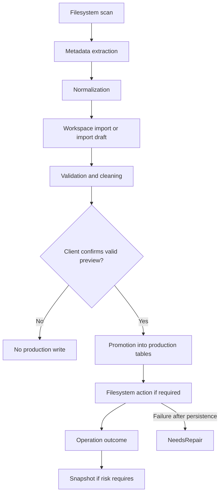

# Import Workflow

## Purpose and scope

This Specification defines the behavior of large Curator imports, including the current Album import and future Photo import. Import is a Backend workflow, not a script that accesses the database directly.

It covers the workflow boundary from source discovery through durable outcome recording. Source-specific metadata extraction and permanent-entity field definitions are separate Specifications.

## Responsibilities

| Actor | Responsibility |
| --- | --- |
| Client | Submits source selection and confirms an import only after reviewing the preview. |
| Import Service | Coordinates stages, business validation, persistence, filesystem work, operation state, and repair hand-off. |
| Repositories | Retrieve/create permitted entities and persist workflow outcomes. |
| Filesystem adapter | Performs only the requested copy, move, rename, or scan action. |
| Repair workflow | Resolves a database/filesystem inconsistency after a failed filesystem stage. |

## Workflow

## Inputs and outputs

Inputs must identify the source, proposed import action, selected metadata/relationships where required, and the client confirmation. A preview must expose normalized proposed data, validation errors, detected collisions, entity reuse/creation implications, filesystem implications, and whether the item is eligible for execution.

Outputs identify each item as completed, rejected, skipped, failed, or requiring repair. Material outcomes expose the related Operation identifier. A successful result must not be returned for an item whose required filesystem action failed.

## Validation rules

- Normalize and compare paths using the Canonical Path Rules before persistence or filesystem mutation.
- Reject items with unresolved validation errors, path collisions, relationship violations, or lifecycle violations.
- Do not silently overwrite a destination or conflicting directory.
- Require explicit client confirmation after preview for execution.
- Reuse or create related permanent entities only through Backend business rules; no client may issue direct persistence instructions.

## Error handling and repair

Database and filesystem cannot share one atomic transaction. If persistence succeeds but filesystem work fails, the Backend retains the persisted context, records `NeedsRepair`, and hands the case to the Repair Workflow. It does not automatically delete business data to simulate rollback.

If failure occurs before a durable business change, the item is unsuccessful and no successful import is reported. Per-item results must allow a batch to report mixed outcomes without hiding failures.

## Operation and snapshot requirements

Every import execution produces Operation records sufficient to identify the initiator, affected entities, stages, failures, and repair state. Bulk imports and other high-risk imports are snapshot candidates; the Service applies the Snapshot Specification. Preview alone does not create a production import Operation or snapshot.

## Open Questions

- What preview fields and confirmation representation are required for Album import versus future Photo import?
- When does a source discovery result become a persisted Workspace record rather than a transient import draft?
- Which import actions are copy-only, move-only, or user-selectable?
- What counts as a duplicate for each production entity before an explicit merge workflow exists?

## Future extensions

Photo import may introduce `workspace_photo` and follows this same staged workflow. File manifests, sizes, and hashes can become validation inputs when a defined use case requires them.
