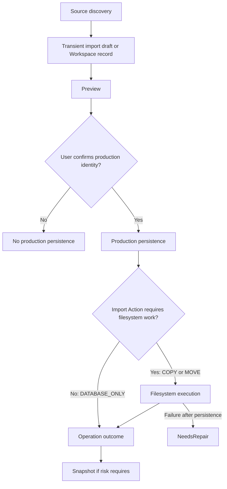

# Import Workflow

## Purpose and scope

This Specification defines Curator import behavior from source discovery through durable outcome recording. Import is a Backend workflow, not a script that accesses the database directly. Source-specific metadata extraction and permanent-entity field definitions are separate Specifications.

Album import is the primary production import workflow. It supports both onboarding a completely new Archive into Curator and importing additional Albums into an existing Archive. The initial scan that discovers and persists production Albums uses this same workflow against an empty production database; it is not a special case. This permits Curator to manage multiple independent Archives in the future.

Photo import is a future Album-scoped workflow. A Photo must not become a production entity unless it belongs to an Album.

## Responsibilities

| Actor | Responsibility |
| --- | --- |
| Client | Selects the source and Import Action, reviews the preview, and confirms the production identity before execution. |
| Import Service | Coordinates stages, derives and validates production identity, duplicate checks, production persistence, filesystem execution, Operation state, and repair hand-off. |
| Domain Services | Apply entity and relationship business rules used by the Import Service. |
| Repositories | Retrieve/create permitted entities and persist confirmed production and Workspace outcomes. |
| Filesystem adapter | Performs only the filesystem action requested by the Import Service. |
| Repair workflow | Resolves a database/filesystem inconsistency after a failed filesystem stage. |

## Staged workflow

The stages are distinct. The Workflow coordinates them; Domain Services own entity rules; Repositories own persistence; and the Filesystem adapter owns requested filesystem operations only.

## Album preview and confirmation

The Album preview must provide enough information for the user to confirm the proposed production identity before persistence. At minimum, it includes:

- `primary_model`
- `additional_models`
- `studio_name`
- `album_name`
- whether the source will create a new Album or be associated with an existing Album

For authenticated API clients, Preview also returns a signed, short-lived
`preview_token`. It binds the normalized importable items, canonical
destinations, configured Archive root/default Studio, exactly one Import Action
(`COPY`, `MOVE`, or `DATABASE_ONLY`), and deterministic source-state
fingerprints. The token is an execution capability, not a durable record;
Preview still creates no Album, Operation, Snapshot, or filesystem mutation.

Execution accepts only this token. Before claiming it, the Import Service
verifies signature and expiry and recomputes source, destination, database, and
configuration state. Invalid, expired, or stale Preview is rejected without
production mutation. A valid Preview is atomically claimed for one execution
attempt; replay and concurrent duplicate claims are rejected. Once execution
has started, the normal Operation and `NeedsRepair` rules govern truthful
partial outcomes.

The preview also exposes the proposed canonical path, validation errors, canonical-path collisions, entity reuse/creation implications, the selected or automatic Import Action, filesystem implications, and eligibility for execution. Production persistence must not occur until the Album identity has been confirmed.

## Import drafts and Workspaces

A transient import draft exists only for the current import session. It is temporary, is neither production data nor a persisted Workspace record, and cannot be reopened after the session.

A Workspace record is persisted, can be reopened later, and supports long-running or recoverable import work under the Workspace Workflow. Future clients may expose persisted Workspace import as an advanced option. Transient drafts remain the default workflow.

## Import Action and filesystem behavior

Filesystem behavior is determined exclusively by the selected Import Action, not by the type of production entity. Production entities, including Album, Photo, Model, and Studio, must not implicitly determine filesystem behavior.

| Import Action | Required behavior |
| --- | --- |
| `DATABASE_ONLY` | Persist confirmed production metadata only; perform no filesystem operation. |
| `COPY` | Persist confirmed production metadata and copy the source to the validated canonical destination. User-selectable. |
| `MOVE` | Persist confirmed production metadata and move the source to the validated canonical destination. Default action. |

If a source Album is already located at its canonical destination, the workflow must automatically use `DATABASE_ONLY` and update production metadata without filesystem work. The Filesystem adapter receives only the action selected by this policy; it does not infer policy from an entity type.

## Validation and duplicate detection

The Import Service must normalize and compare paths using the Canonical Path Rules before production persistence or filesystem mutation. It rejects unresolved validation errors, canonical-path collisions, relationship violations, and lifecycle violations. It must not silently overwrite a destination or conflicting directory.

Until a dedicated merge workflow exists, duplicate detection is intentionally conservative: production entities are duplicates only when they resolve to the same canonical path. Import does not perform semantic duplicate detection. Identity reconciliation, aliases, duplicate Model records, and face-recognition-assisted repair belong to future Repair/Merge workflows.

## Photo import

Future Photo import follows this order:

1. import and persist the Album;
2. import Photos into that Album.

Photo import primarily confirms the destination Album rather than individual Photos. Future image-metadata extraction is expected. Detailed face recognition, person tagging, and `photo_model` maintenance are outside this Specification.

## Error handling and repair

Database and filesystem work cannot share one atomic transaction. If production persistence succeeds but required filesystem execution fails, the Backend retains the persisted context, records `NeedsRepair`, and hands the case to the Repair Workflow. It does not automatically delete business data to simulate rollback.

If failure occurs before a durable business change, the item is unsuccessful and no successful import is reported. Per-item results must allow a batch to report mixed outcomes without hiding failures.

## Operation and snapshot requirements

Every import execution produces Operation records sufficient to identify the initiator, affected entities, stages, selected Import Action, failures, and repair state. Bulk imports and other high-risk imports are snapshot candidates; the Import Service applies the Snapshot Specification. Preview alone does not create a production import Operation or snapshot.

## Open Questions

- Which source-specific metadata fields and validation rules are required for future Photo import?
- What user-confirmation and conflict-resolution interaction is required when a source maps to an existing Album?

## Future extensions

File manifests, sizes, and hashes can become validation inputs when a defined use case requires them. Repair/Merge workflows may later introduce semantic identity reconciliation without changing the conservative duplicate rule of Import.
