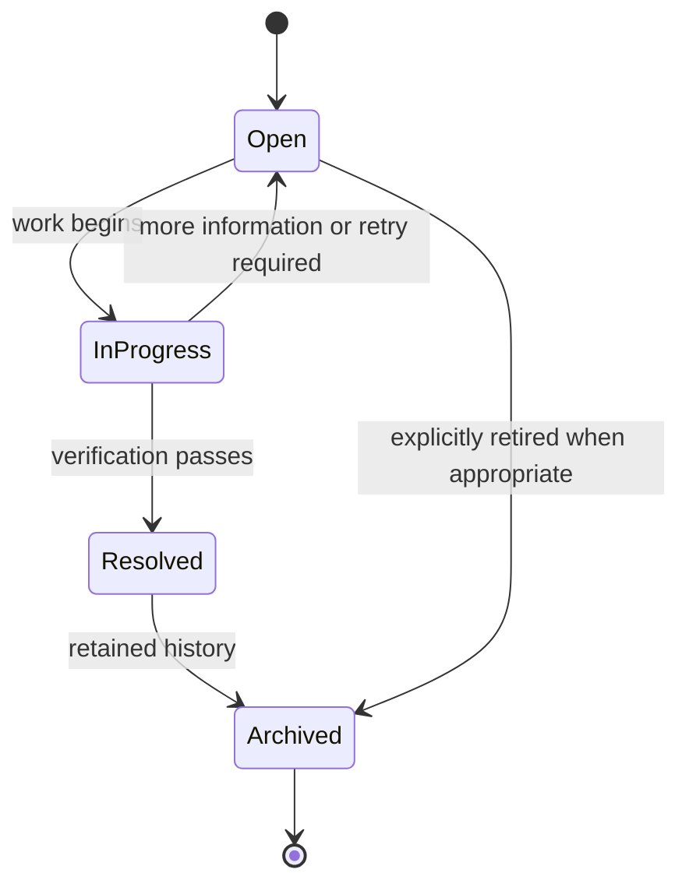

# Issue Management Specification

## Purpose and scope

An Issue is a persistent, reviewable record of a problem that requires tracking until verified resolution. It is the shared mechanism for problems found by validation, filesystem health, import, repair, AI processing, security, and device registration.

An Issue does not itself perform a repair, grant authorization, or replace an Operation record. It links persistent review work with the workflow that detected it.

## Lifecycle

## Required behavior

- A detected problem requiring persistent attention creates or updates an Issue.
- Issues identify their category, source workflow, affected entity UUIDs where known, current lifecycle state, and enough summary/context for review.
- Resolution requires verification appropriate to the originating workflow. A filesystem-repair Issue is not resolved merely because a repair command was attempted.
- Archiving retains historical context and removes the Issue from normal active work; it does not erase it.
- Clients view and act on Issues only through authorized `/api/v1` operations.

## Initial Issue model

An Issue must include the following fields:

- `category`
- `description`
- `affected_operation`
- `suggested_resolution`
- `state`
- `source_workflow`
- `created_at`

The recommended fields are `priority`, `owner`, and `due_date`.

- `owner` may only be assigned by an Administrator.
- `due_date` is optional and defaults to a low-priority value suitable for a personal deployment. It is retained for future multi-user or production scenarios.
- `priority` remains intentionally simple, using values such as Normal, High, and Critical. The initial model must not introduce a complex priority system.

## Categories

Initial categories are Validation, Filesystem, Import, Repair, AI Processing, Security, and Device Registration. New categories must preserve the same lifecycle and be documented in this Specification before implementation.

## Relationship with Operations

An Issue may be created by, linked to, or resolved through one or more Operations. Operations state what happened; Issues state what still needs attention. A failure that needs repair typically creates both an unsuccessful/repair Operation outcome and an open Issue.

## Repeated issue detection

A repeated detection updates an existing Issue rather than creating a new Issue only when it has the same underlying root cause, affects the same entity or logical object, and requires the same corrective action.

The existing Issue must retain the latest detection information, such as timestamps, latest workflow, occurrence count, and additional evidence. If the root cause or required resolution differs, a new Issue must be created. This prevents duplicate active Issues while preserving a complete history of repeated detections.

## Permissions

For the current Curator architecture, only Administrators may assign Issue ownership, resolve Issues, or archive Issues. Future role-based extensions may expand these permissions, but are out of scope for this specification.

## Notification behavior

The primary UI must provide a persistent Issue notification badge, similar to a GitHub or GitLab issue indicator. The badge displays the number of active Issues by counting Issues in the `Open` and `InProgress` states. It does not count `Resolved` or `Archived` Issues and remains visible until an Issue is resolved or archived.

The badge provides continuous awareness of unresolved problems without interrupting normal workflows.

## Error handling

- Failure to create a required Issue must not cause the underlying discrepancy to be represented as resolved.
- An invalid lifecycle transition is rejected.
- An Issue cannot be resolved without the verification required by its category/workflow.

## Future extensions

Issue data may power validation and archive-health dashboards. It must remain lightweight and local-first unless an ADR changes that architecture.
