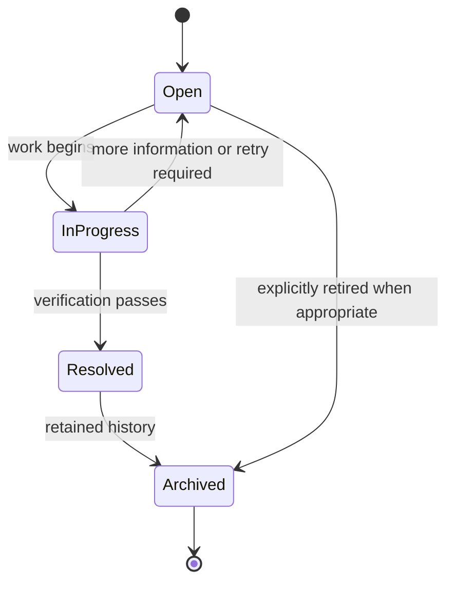

# Issue Management Specification

## Purpose and scope

An Issue is a persistent, reviewable record of a problem that requires tracking until verified resolution. It is the shared mechanism for problems found by validation, filesystem health, import, repair, AI processing, security, and device registration.

An Issue does not itself perform a repair, grant authorization, or replace an Operation record. It links persistent review work with the workflow that detected it.

## Lifecycle

## Required behavior

- A detected problem requiring persistent attention creates or updates an Issue.
- Issues identify their category, source workflow, affected entity UUIDs where known, current lifecycle state, and enough summary/context for review.
- Resolution requires verification appropriate to the originating workflow. A filesystem-repair Issue is not resolved merely because a repair command was attempted.
- Archiving retains historical context and removes the Issue from normal active work; it does not erase it.
- Clients view and act on Issues only through authorized `/api/v1` operations.

## Categories

Initial categories are Validation, Filesystem, Import, Repair, AI Processing, Security, and Device Registration. New categories must preserve the same lifecycle and be documented in this Specification before implementation.

## Relationship with Operations

An Issue may be created by, linked to, or resolved through one or more Operations. Operations state what happened; Issues state what still needs attention. A failure that needs repair typically creates both an unsuccessful/repair Operation outcome and an open Issue.

## Error handling

- Failure to create a required Issue must not cause the underlying discrepancy to be represented as resolved.
- An invalid lifecycle transition is rejected.
- An Issue cannot be resolved without the verification required by its category/workflow.

## Open Questions

- Which fields, priorities, ownership assignments, and due dates are required in the initial Issue model?
- When should repeated detections update an existing Issue rather than create a new one?
- Which roles may resolve or archive each Issue category?
- What notification behavior is required for open or escalated Issues?

## Future extensions

Issue data may power validation and archive-health dashboards. It must remain lightweight and local-first unless an ADR changes that architecture.
