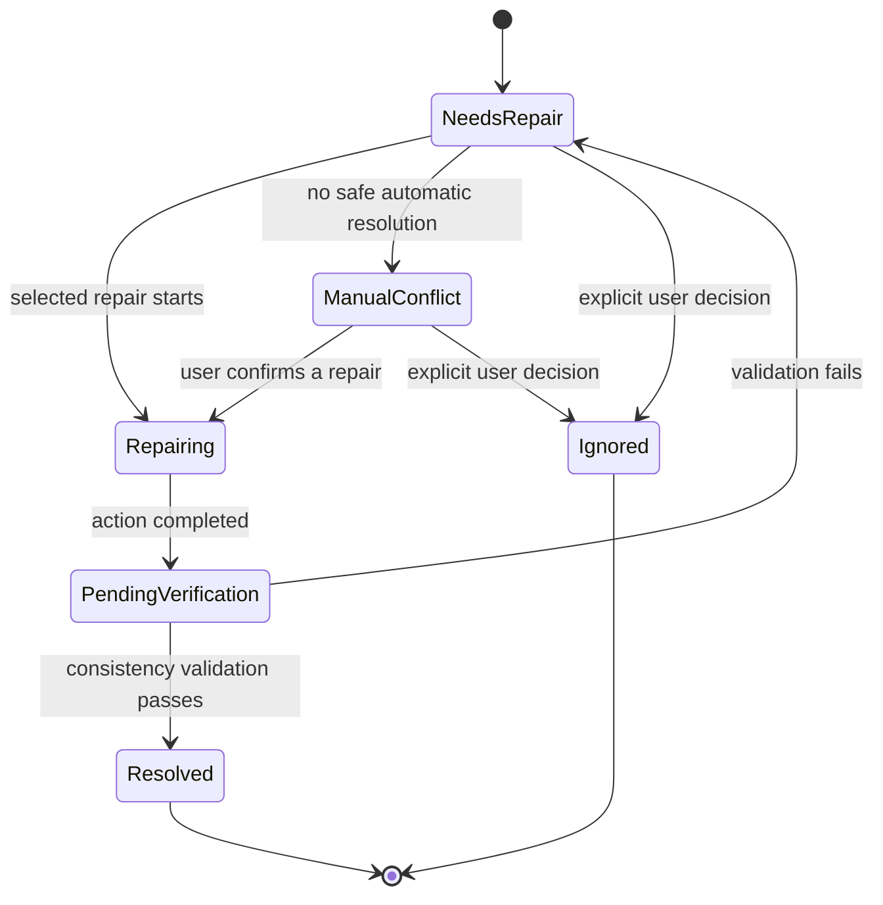

# Repair Workflow

## Purpose and scope

This Specification governs repair of discrepancies between persisted Curator state and the filesystem. Repair is a first-class Backend workflow. It protects the canonical database path while avoiding silent overwrite or deletion of user data.

## Repair state machine

## Inputs and outputs

A repair case includes an Operation identifier, expected canonical path, completed stages, failure reason, affected entity UUIDs where known, observed filesystem state, and available repair choices.

The output is one of the repair states plus verification results and any remaining Issue. `Resolved` is permitted only after required consistency validation succeeds.

## Repair categories

| Category | Backend behavior | Confirmation |
| --- | --- | --- |
| Automatic | Deterministic project-rule-preserving corrections, such as removing trailing spaces, collapsing multiple spaces, or normalizing case. Record Operation and audit log; notify user. | No individual confirmation after the policy permits it. |
| Assisted | Suggest a safe action for missing folders, fuzzy matches, Studio-name mismatch, or rename suggestion. | User chooses whether to proceed. |
| Manual conflict | Conflicting directories or ambiguous conditions without a safe automatic resolution. | Explicit user resolution required. |

Available assisted/manual choices may include retrying the original copy/move, safely renaming a real folder to the canonical database path, quarantining a conflicting directory and retrying, updating the database path only after verifying a real folder and receiving confirmation, or manual repair followed by validation.

## Validation rules

After any repair, the Backend validates at least:

- canonical path agreement;
- expected directory existence;
- case conflicts;
- trailing whitespace;
- Unicode-normalization conflicts.

The canonical database path is the intended source of truth. A real path that differs only by a correctable naming defect should be safely renamed rather than silently changing the canonical database path. No repair may silently overwrite or delete data.

## Error handling, Operations, and Issues

- A repair action records an Operation and supporting audit log.
- A failed or incomplete repair remains visible in `NeedsRepair` or `ManualConflict`; it is never represented as resolved.
- A detected discrepancy creates or updates a related Issue when persistent review is required.
- Ignoring a repair requires an explicit decision and remains auditable.

## Snapshot requirements

Bulk filesystem renames, quarantines affecting multiple directories, and other hard-to-reverse repair actions are snapshot candidates. Ordinary low-risk deterministic repairs normally rely on Operation records unless the Snapshot Specification classifies them otherwise.

## Open Questions

- Which automatic corrections are safe enough to run without per-item confirmation?
- What evidence is sufficient to accept a fuzzy path match?
- What quarantine location, retention, access, and restoration rules apply?
- Which repair actions require a snapshot before execution?

## Future extensions

Validation may later compare file manifests, file sizes, or hashes. These additions must not weaken the existing path-level verification requirement.
