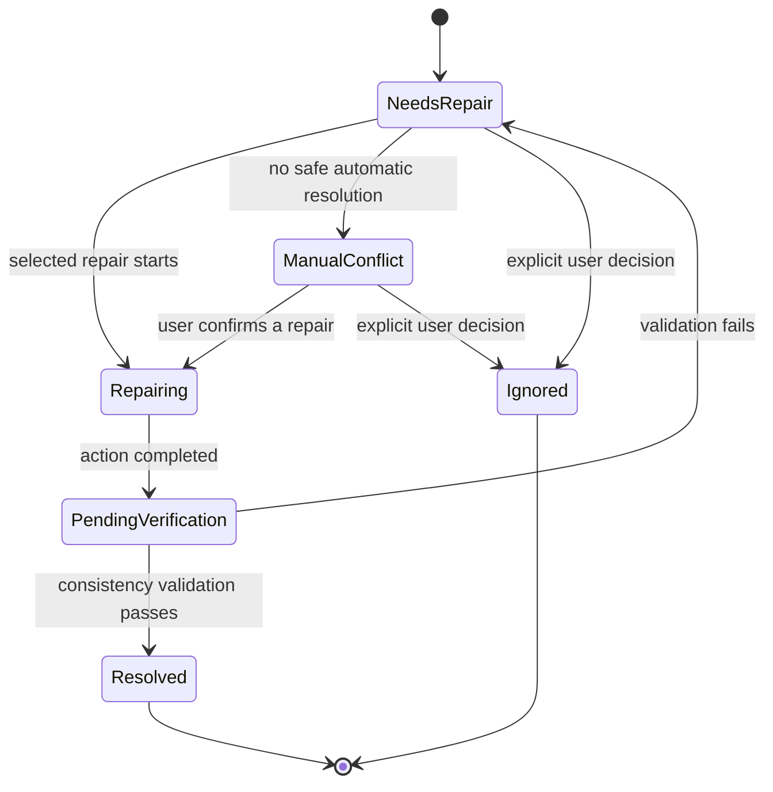

# Repair Workflow

## Purpose and scope

This Specification governs repair of discrepancies between persisted Curator state and the filesystem. Repair is a first-class Backend workflow. It protects the canonical database path while avoiding silent overwrite or deletion of user data.

## Repair state machine

## Inputs and outputs

A repair case includes an Operation identifier, expected canonical path, completed stages, failure reason, affected entity UUIDs where known, observed filesystem state, and available repair choices.

The output is one of the repair states plus verification results and any remaining Issue. `Resolved` is permitted only after required consistency validation succeeds.

`Ignored` is a terminal state for the current repair case only. It records that an authorized user explicitly chose not to repair that case; it does not assert that the filesystem is consistent and does not resolve a related Issue. A later scan must create or update repair tracking when it observes the same discrepancy again, unless a separate active suppression record applies. An `Ignored` case may therefore be rediscovered after any later scan that observes the discrepancy, including a scan of unchanged filesystem state.

To intentionally prevent rediscovery, the Backend must use a separate, auditable suppression record rather than `Ignored`. A suppression record must identify the discrepancy fingerprint and its affected entity or canonical path, its bounded scope, reason, creator, creation time, expiry or review time, and revocation state. Only an Administrator may create, extend, or revoke it. A scan may suppress a finding only while a matching, active record applies; it must record that suppression was applied. An expired or revoked suppression must not affect scanning, and the finding must be detected normally.

## Repair categories

| Category | Backend behavior | Confirmation |
| --- | --- | --- |
| Automatic | Only the bounded deterministic corrections defined in **Automatic-correction policy**. Record Operation and audit log; notify user. | No individual confirmation after the policy permits it. |
| Assisted | Present a candidate and its evidence for a user-confirmed action, including a fuzzy path match, missing folder, Studio-name mismatch, or rename suggestion. | User chooses whether to proceed. |
| Manual conflict | Conflicting directories or ambiguous conditions without a safe automatic resolution. | Explicit user resolution required. |

Available assisted/manual choices may include retrying the original copy/move, safely renaming a real folder to the canonical database path, quarantining a conflicting directory and retrying, updating the database path only after verifying a real folder and receiving confirmation, or manual repair followed by validation.

`Automatic`, `Assisted`, and `Manual conflict` classify how a repair action is selected and authorized; they are not terminal states. In client prose, `Manual` means the `ManualConflict` state. Every selected action enters `Repairing`, then `PendingVerification`. Only successful validation permits `Resolved`; a failed validation returns the case to `NeedsRepair` or `ManualConflict`. `Ignored` ends the current case without executing a repair action. Snapshot protection, when required below, must be created successfully before the protected action begins.

## Normative automatic-correction policy

The Backend may execute a repair without per-item confirmation only when all of the following are true:

- the correction is a directory rename from the one observed managed directory to the already computed canonical database path;
- the source and destination differ solely by the canonicalization rules in [Canonical Path Rules](Canonical-Path-Rules.md): leading or trailing component whitespace, Unicode NFC representation, and/or case-only representation;
- canonicalization maps the observed path to the expected canonical path component by component;
- exactly one source directory satisfies those conditions, the destination does not already exist, and no managed path or comparison-key collision results;
- the action changes neither directory contents nor database metadata, overwrites nothing, and can be reversed by renaming the same directory back; and
- the required pre-action validation, Operation record, and audit record have been completed.

These are the complete initial automatic corrections. Interior whitespace changes (including collapsing spaces), token substitutions, fuzzy matches, database-path changes, merges, deletions, quarantine, and any action with multiple plausible targets are not automatic. A correction that does not meet every condition must be Assisted or Manual conflict, even if it appears low risk.

## Normative fuzzy path-match evidence

A fuzzy match is a proposed observed path that is not an automatic canonicalization-only match. It must never be accepted solely because names look similar, have a small edit distance, or share tokens.

The Backend may offer a fuzzy candidate only when it has all of the following evidence: the candidate is under the same managed root; it has the expected component count and path kind; every parent component agrees with the expected parent by canonical comparison key; there is exactly one candidate after those structural checks; and there is one independent authoritative signal linking the candidate to the affected entity or failed operation. An authoritative signal is either a durable Curator entity identifier stored with the directory, or Operation provenance showing that the same repair chain created, moved, or previously identified that exact directory. Name similarity is not an authoritative signal.

Even with this evidence, fuzzy matching is an Assisted action and requires explicit user confirmation of the displayed source, destination, and evidence. If any required evidence is missing, contradictory, or shared by more than one candidate, the Backend must reject the fuzzy match and place or retain the case in `ManualConflict`.

## Normative quarantine policy

Quarantine is a temporary isolation mechanism, not deletion and not a substitute for validation. Quarantined directories must be moved intact to the Curator-controlled quarantine root configured outside the managed archive namespace. Each item must be stored under a unique quarantine identifier and retain its original path, repair identifier, initiating Operation, timestamps, reason, and content inventory sufficient to identify it for restoration.

The Backend retains quarantined items for 30 days from quarantine, unless an Administrator explicitly places the item on hold or extends retention. Only Administrators may list, inspect, restore, extend, or release quarantined items; normal repair clients may see only the repair-safe status and identifier. All access and retention decisions require audit records.

Restoration requires an Administrator to select the quarantined item and a destination, confirm that the destination is safe and non-conflicting, create any required snapshot, move the item intact, and run the applicable consistency validation. Restoration must not overwrite an existing path. At retention expiry, the Backend must create an auditable expiry disposition: a held item remains retained; an unheld item may be permanently removed only by an authorized retention job after recording the item identity, expiry decision, and deletion outcome. Expiry removal is irreversible and must follow the snapshot policy below when it affects multiple directories or otherwise meets the required-snapshot criteria.

For the initial Web management API, the selectable quarantine candidate is the
managed-relative path retained by the Repair case, and the only selectable
restore destination is the item's retained original managed-relative path.
Both actions require signed, expiring, single-use preview identity bound to the
directory inventory and current workflow state. This narrower contract fulfills
safe selection without exposing general filesystem browsing.

## Validation rules

After any repair, the Backend validates at least:

- canonical path agreement;
- expected directory existence;
- case conflicts;
- trailing whitespace;
- Unicode-normalization conflicts.

The canonical database path is the intended source of truth. A real path that differs only by a correctable naming defect should be safely renamed rather than silently changing the canonical database path. No repair may silently overwrite or delete data.

## Error handling, Operations, and Issues

- A repair action records an Operation and supporting audit log.
- A failed or incomplete repair remains visible in `NeedsRepair` or `ManualConflict`; it is never represented as resolved.
- A detected discrepancy creates or updates a related Issue when persistent review is required.
- Ignoring a repair requires an explicit decision and remains auditable.
- UI decisions bind the Repair `updated_at` observed during review and may use
  only the Backend-returned allowed actions. Confirmation and verification
  evidence are mandatory where the state machine requires them. Every accepted
  decision creates a linked Operation; stale or repeated decisions do not
  execute workflow or filesystem work.

## Snapshot requirements

Before executing a repair action, the Service must classify whether a snapshot is required under the [Snapshot Specification](Snapshot-Specification.md). Snapshot creation is mandatory, and must succeed before execution, for bulk filesystem renames; quarantine actions affecting multiple directories; permanent expiry removal of quarantined items affecting multiple directories; any deletion, overwrite, merge, or database-path rewrite; and any other action that is destructive, hard to reverse, or would require manual reconstruction to roll back.

The repair Operation must reference the snapshot and its risk reason. If a required snapshot cannot be created or validated, the action must not begin and the case remains unresolved. The narrowly defined automatic canonicalization-only rename above does not require a snapshot solely because it is automatic, but it remains subject to any additional requirement imposed by the Snapshot Specification.

## Future extensions

Validation may later compare file manifests, file sizes, or hashes. These additions must not weaken the existing path-level verification requirement.
