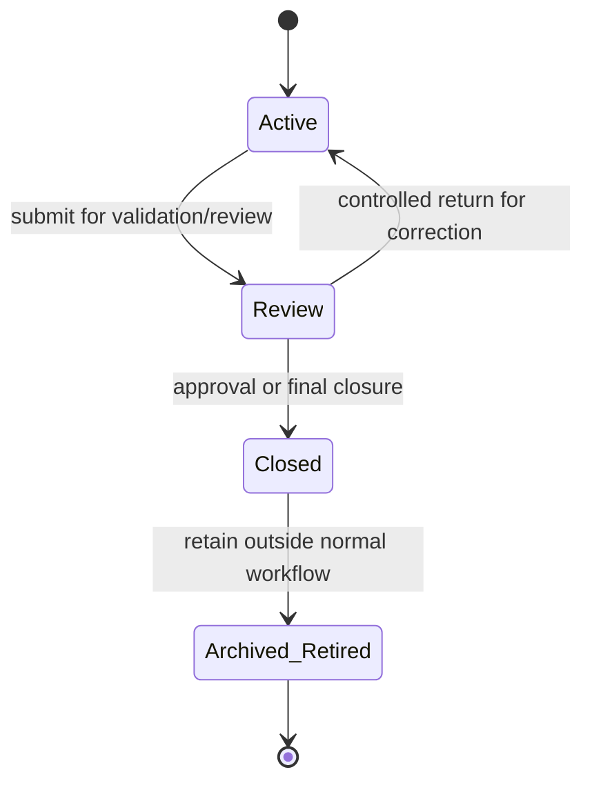

# Workspace Workflow

## Purpose and scope

This Specification governs temporary Curator workspace datasets. `workspace_album` is the completed historical example: it was used to normalize and materialize the existing Album catalogue and is now to be closed and archived. Future workspace datasets, such as `workspace_ai_album`, `workspace_photo`, and other AI-related workspace records, inherit the same lifecycle and must define their own dataset contract.

Workspace data is not a permanent business entity. It exists to support import, enrichment, validation, review, and controlled promotion into permanent production tables.

## Lifecycle state definitions

- **Active Workspace:** Operational workspace data used for ongoing import, enrichment, AI processing, user editing, and validation preparation. It is the only state intended for normal working changes.
- **Review:** A controlled validation and approval stage before promotion or closure. Review is not a general editing phase; it permits only the documented modifications required to complete review.
- **Closed:** A read-only historical record of a completed workspace. Closed workspaces remain available for audit, troubleshooting, migration, and historical reference, but are not part of active business editing or processing.
- **Archived / Retired:** Historical workspace data removed from normal operational workflows while retaining the long-term history needed for traceability, audit, and future migration. Archived / Retired data is not eligible for normal workflow participation.

## Lifecycle state machine



| State | Allowed behavior | Prohibited behavior |
| --- | --- | --- |
| Active | Full CRUD, AI processing, user editing, validation preparation. | Promotion without required validation/review. |
| Review | Read, validation, approval, and only controlled modifications required to complete review. | Uncontrolled business editing or AI changes. |
| Closed | Read-only audit, troubleshooting, migration, and historical-reference access. | Business modifications or normal active processing. |
| Archived / Retired | Long-term historical retention outside normal operational workflows. | Normal workflow participation or business modifications. |

## Controlled Review Modifications

Review is not a general editing phase. It exists only to complete validation and approval before promotion or closure. During Review, changes are permitted only when they are required to complete that review and are explicitly allowed by the workspace dataset's Review editing contract.

Every workspace dataset must define its own Review editing contract in its specification. This includes `workspace_album`, `workspace_ai_album`, future `workspace_photo` datasets, and any other workspace dataset. The contract must explicitly identify its fields as:

- **Immutable imported or generated data:** Source data imported into the workspace and raw AI output normally remain unchanged during Review. A workflow may permit an exception only when it explicitly documents the field and the reason for allowing the change.
- **Reviewer-controlled fields:** Fields a reviewer may change to complete review. Typical examples are `status`, approval state, review notes, and selected candidate values.
- **System-managed fields:** Fields maintained by services or workflow execution, including lifecycle, audit, and other system-generated information. Reviewers must not edit these fields directly.

Imported source data, AI raw output, and audit information are normally immutable during Review unless the applicable workspace workflow explicitly defines otherwise. Changes outside the documented Review editing contract are not allowed.

### `workspace_album` Review and promotion contract

`workspace_album` is the historical Workspace dataset used to materialize the
existing permanent Album catalogue. It is not the normal entry point for new
Album imports. Its remaining records are to be reviewed, promoted where
approved, then retained as closed and archived history.

`lifecycle_state` and `status_id` have distinct meanings. The lifecycle state
expresses the Workspace stage. `status_id` expresses the business and review
conclusion for the row. The Workspace status catalogue must provide at least
`PendingReview`, `ReturnedForCorrection`, `Approved`, and `Rejected` (or
stable, documented equivalents). The historical `Ready` status may be mapped
to `Approved` during the legacy-data migration; new review decisions use
`Approved`.

Within lifecycle state `Review`, a reviewer may change only the selected
business values `studio_name`, `album_name`, `primary_model`,
`additional_models`, `remark`, and `belongs_to_album_id`, and may make the
documented review-status transition. These are candidate values until the
reviewer records `status_id = Approved`. `Approved` freezes them as the final
selection. A correction requires the explicit transition to
`ReturnedForCorrection`, with its reason retained in the audit trail, before a
further edit is permitted. `Rejected` is terminal for promotion. The decision
record must retain the reviewer, decision time, status transition, and reason.
Writers may submit a Workspace row for Review and make permitted corrections;
only an Administrator may approve, reject, return for correction, or execute
promotion. An Administrator must not approve a row that the same principal
submitted unless an explicit future separation-of-duties exception is defined.

`current_path` is the observed imported filesystem value and is immutable in
Review. `expected_path` is not a reviewer-editable field: a controlled
canonicalization and validation action may calculate or update it, with
durable evidence. `ai_result`, `album_id`, lifecycle fields, timestamps, and
all audit or Operation fields are system-managed and never reviewer-editable.

Promotion is permitted only for an `Approved` row that passes all of the
following checks:

- required Studio, Album title, primary Model, and review decision are present;
- the Studio and every selected Model resolve uniquely to permanent entities;
- the observed and expected paths have passed the applicable canonical-path
  and filesystem validation, and the resulting permanent path has no
  conflicting Album;
- a non-self `belongs_to_album_id` points to an approved Workspace row that is
  included in the same promotion set; and
- no existing permanent Album conflicts with the requested materialization.

The promotion set is processed in two durable phases. First, every approved
Workspace row creates one permanent `album`, writes its canonical
`expected_path` to `album.path`, copies `remark` to `album.remark`, creates
its `album_model` records, and records the generated permanent ID in
`workspace_album.album_id`. Second, each non-self Workspace relationship is
resolved through those two `album_id` values and written as one
`album_relation` with `relation_type = 'BELONGS_TO'`. A null or self
`belongs_to_album_id` creates no relation. The Service owns this mapping; a
client cannot supply a permanent `album_id` or a direct relation target.

Promotion is database materialization, not a filesystem mutation. Filesystem
normalization or repair, if required, completes and verifies before approval.
The Service creates a truthful Operation, applies the risk-based snapshot
policy, and writes the promotion atomically. A required snapshot failure or
validation failure creates no partial permanent materialization. An unexpected
failure is never reported as success; if a durable inconsistency cannot be
rolled back it remains visible through the Operation and Repair workflows.
After successful materialization the Workspace row is `Closed`; the legacy
`workspace_album` collection is then archived under the historical-retention
policy. A rejected record may be closed without promotion only with an
auditable rejection or cancellation reason.

## Responsibilities

- Services enforce lifecycle state, permitted actions, validation, promotion rules, and transitions.
- Repositories persist workspace data and lifecycle state.
- API adapters expose only actions permitted by the current lifecycle state.
- Clients submit edits and approvals through `/api/v1`; they never modify workspace tables directly.

## Workflow

```text
Create or import workspace data
  -> Active editing / AI processing
  -> validation
  -> Review
  -> correction or approval
  -> promotion or closure
  -> Closed
  -> Archived / Retired when no longer part of normal work
```

Promotion is a Service-owned workflow. It validates the workspace data and writes to permanent production entities through repositories. A promotion can require an Operation record and a risk-based snapshot under the applicable Specifications.

## Historical retention direction

Closed and Archived / Retired workspaces are historical reference data, distinct from Active Workspace and Review data used by normal operational workflows. The architecture must preserve traceability and audit history, allow future migration, and reduce the impact of historical workspaces on normal operational workflows.

The storage and retention strategy may evolve by workspace dataset and does not require a specific implementation. Closed and Archived / Retired data may remain in the primary database or move to another suitable storage approach, such as an archive database or compressed storage, provided the architectural goals above continue to be met.

## Validation and error handling

- A requested operation not allowed in the current lifecycle state is rejected without modifying the workspace.
- Validation failures prevent the relevant promotion or closure action and are reported as validation outcomes or Issues where persistent tracking is needed.
- A failed promotion must not be reported as successful. If filesystem work has already created a persistent inconsistency, it follows the Repair Workflow.
- Closed and Archived / Retired data must never be changed by ordinary business operations.

## Operation and snapshot requirements

Lifecycle transitions, promotion, and material batch changes create Operation records. Snapshot need is determined by operation risk; Workspace-to-production promotion is a typical snapshot candidate.

## Open Questions

- What future retention periods, access expectations, and storage strategies should apply to Closed and Archived / Retired workspaces while preserving the historical-retention goals?

## Future extensions

New workspace tables automatically use this lifecycle. Their fields, AI workflows, and promotion criteria are separate Specifications and must not redefine these states.
