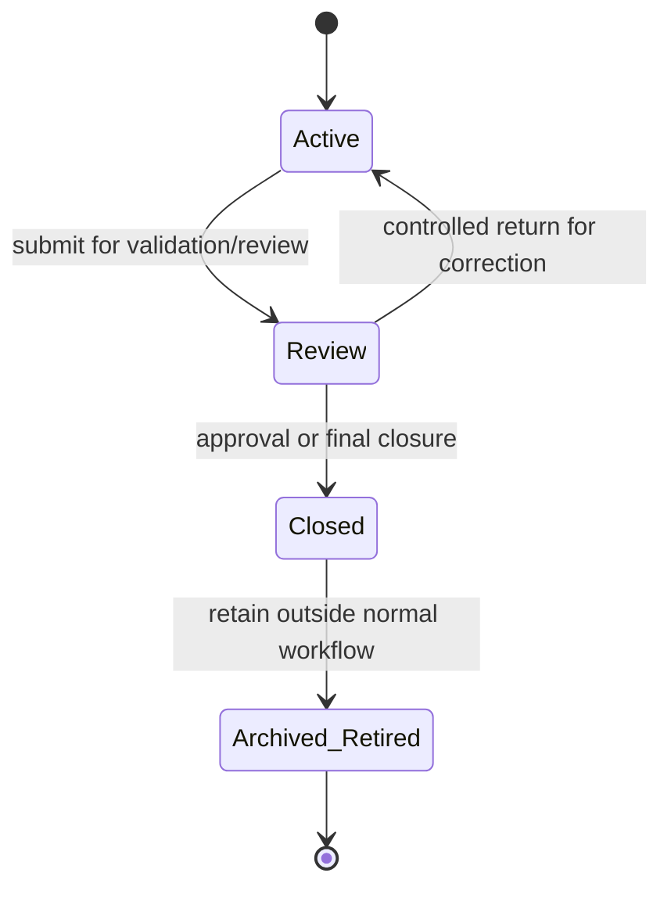

# Workspace Workflow

## Purpose and scope

This Specification governs temporary Curator workspace datasets. `workspace_album` is the current example; future workspace datasets, such as `workspace_ai_album`, `workspace_photo`, and other AI-related workspace records, inherit the same lifecycle.

Workspace data is not a permanent business entity. It exists to support import, enrichment, validation, review, and controlled promotion into permanent production tables.

## Lifecycle state definitions

- **Active Workspace:** Operational workspace data used for ongoing import, enrichment, AI processing, user editing, and validation preparation. It is the only state intended for normal working changes.
- **Review:** A controlled validation and approval stage before promotion or closure. Review is not a general editing phase; it permits only the documented modifications required to complete review.
- **Closed:** A read-only historical record of a completed workspace. Closed workspaces remain available for audit, troubleshooting, migration, and historical reference, but are not part of active business editing or processing.
- **Archived / Retired:** Historical workspace data removed from normal operational workflows while retaining the long-term history needed for traceability, audit, and future migration. Archived / Retired data is not eligible for normal workflow participation.

## Lifecycle state machine



| State | Allowed behavior | Prohibited behavior |
| --- | --- | --- |
| Active | Full CRUD, AI processing, user editing, validation preparation. | Promotion without required validation/review. |
| Review | Read, validation, approval, and only controlled modifications required to complete review. | Uncontrolled business editing or AI changes. |
| Closed | Read-only audit, troubleshooting, migration, and historical-reference access. | Business modifications or normal active processing. |
| Archived / Retired | Long-term historical retention outside normal operational workflows. | Normal workflow participation or business modifications. |

## Controlled Review Modifications

Review is not a general editing phase. It exists only to complete validation and approval before promotion or closure. During Review, changes are permitted only when they are required to complete that review and are explicitly allowed by the workspace dataset's Review editing contract.

Every workspace dataset must define its own Review editing contract in its specification. This includes `workspace_album`, `workspace_ai_album`, future `workspace_photo` datasets, and any other workspace dataset. The contract must explicitly identify its fields as:

- **Immutable imported or generated data:** Source data imported into the workspace and raw AI output normally remain unchanged during Review. A workflow may permit an exception only when it explicitly documents the field and the reason for allowing the change.
- **Reviewer-controlled fields:** Fields a reviewer may change to complete review. Typical examples are `status`, approval state, review notes, and selected candidate values.
- **System-managed fields:** Fields maintained by services or workflow execution, including lifecycle, audit, and other system-generated information. Reviewers must not edit these fields directly.

Imported source data, AI raw output, and audit information are normally immutable during Review unless the applicable workspace workflow explicitly defines otherwise. Changes outside the documented Review editing contract are not allowed.

## Responsibilities

- Services enforce lifecycle state, permitted actions, validation, promotion rules, and transitions.
- Repositories persist workspace data and lifecycle state.
- API adapters expose only actions permitted by the current lifecycle state.
- Clients submit edits and approvals through `/api/v1`; they never modify workspace tables directly.

## Workflow

```text
Create or import workspace data
  -> Active editing / AI processing
  -> validation
  -> Review
  -> correction or approval
  -> promotion or closure
  -> Closed
  -> Archived / Retired when no longer part of normal work
```

Promotion is a Service-owned workflow. It validates the workspace data and writes to permanent production entities through repositories. A promotion can require an Operation record and a risk-based snapshot under the applicable Specifications.

## Historical retention direction

Closed and Archived / Retired workspaces are historical reference data, distinct from Active Workspace and Review data used by normal operational workflows. The architecture must preserve traceability and audit history, allow future migration, and reduce the impact of historical workspaces on normal operational workflows.

The storage and retention strategy may evolve by workspace dataset and does not require a specific implementation. Closed and Archived / Retired data may remain in the primary database or move to another suitable storage approach, such as an archive database or compressed storage, provided the architectural goals above continue to be met.

## Validation and error handling

- A requested operation not allowed in the current lifecycle state is rejected without modifying the workspace.
- Validation failures prevent the relevant promotion or closure action and are reported as validation outcomes or Issues where persistent tracking is needed.
- A failed promotion must not be reported as successful. If filesystem work has already created a persistent inconsistency, it follows the Repair Workflow.
- Closed and Archived / Retired data must never be changed by ordinary business operations.

## Operation and snapshot requirements

Lifecycle transitions, promotion, and material batch changes create Operation records. Snapshot need is determined by operation risk; Workspace-to-production promotion is a typical snapshot candidate.

## Open Questions

- What exact validation and approval conditions allow each kind of workspace data to move from Review to Closed?
- For each workspace dataset, which fields are permitted to change during Review, as explicitly documented in its Review editing contract?
- What future retention periods, access expectations, and storage strategies should apply to Closed and Archived / Retired workspaces while preserving the historical-retention goals?

## Future extensions

New workspace tables automatically use this lifecycle. Their fields, AI workflows, and promotion criteria are separate Specifications and must not redefine these states.
