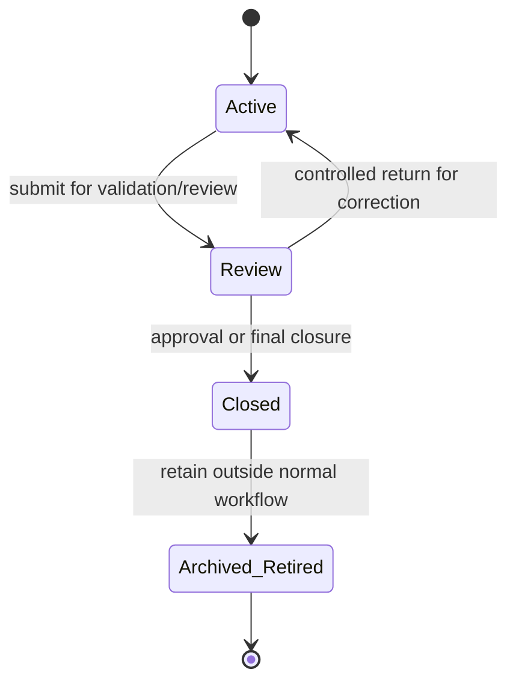

# Workspace Workflow

## Purpose and scope

This Specification governs temporary Curator workspace datasets. `workspace_album` is the current example; future workspace datasets, such as `workspace_photo` and AI-related workspace records, inherit the same lifecycle.

Workspace data is not a permanent business entity. It exists to support import, enrichment, validation, review, and controlled promotion into permanent production tables.

## Lifecycle state machine



| State | Allowed behavior | Prohibited behavior |
| --- | --- | --- |
| Active | Full CRUD, AI processing, user editing, validation preparation. | Promotion without required validation/review. |
| Review | Read, validation, approval, and only controlled modifications required to complete review. | Uncontrolled business editing or AI changes. |
| Closed | Read-only reference, audit, and migration access. | Business modifications. |
| Archived / Retired | Long-term historical retention outside normal workflows. | Normal workflow participation. |

## Responsibilities

- Services enforce lifecycle state, permitted actions, validation, promotion rules, and transitions.
- Repositories persist workspace data and lifecycle state.
- API adapters expose only actions permitted by the current lifecycle state.
- Clients submit edits and approvals through `/api/v1`; they never modify workspace tables directly.

## Workflow

```text
Create or import workspace data
  -> Active editing / AI processing
  -> validation
  -> Review
  -> correction or approval
  -> promotion or closure
  -> Closed
  -> Archived / Retired when no longer part of normal work
```

Promotion is a Service-owned workflow. It validates the workspace data and writes to permanent production entities through repositories. A promotion can require an Operation record and a risk-based snapshot under the applicable Specifications.

## Validation and error handling

- A requested operation not allowed in the current lifecycle state is rejected without modifying the workspace.
- Validation failures prevent the relevant promotion or closure action and are reported as validation outcomes or Issues where persistent tracking is needed.
- A failed promotion must not be reported as successful. If filesystem work has already created a persistent inconsistency, it follows the Repair Workflow.
- Closed and Archived / Retired data must never be changed by ordinary business operations.

## Operation and snapshot requirements

Lifecycle transitions, promotion, and material batch changes create Operation records. Snapshot need is determined by operation risk; Workspace-to-production promotion is a typical snapshot candidate.

## Open Questions

- What exact validation and approval conditions allow each kind of workspace data to move from Review to Closed?
- What controlled changes are permitted in Review for each workspace dataset?
- What retention and physical-storage policy applies to Closed and Archived / Retired workspaces?

## Future extensions

New workspace tables automatically use this lifecycle. Their fields, AI workflows, and promotion criteria are separate Specifications and must not redefine these states.
