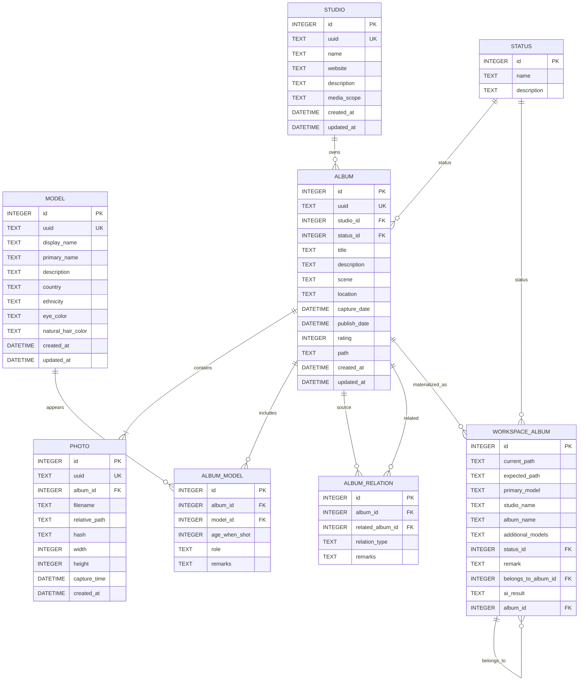

# Curator Database Model v0.2

## Design Principles

### Identity

Every business entity owns:

- id
- uuid

id is used by SQLite foreign keys.

uuid is used as the stable business identifier.

---

### Audit

Every mutable entity contains:

- created_at
- updated_at

---

### File System

Only Album stores the canonical file system path.

Photo stores relative_path only.

`album.path` is the single canonical local path for the released Album. It replaces the redundant `album.current_path` and `album.expected_path` fields. `source_path` is not used because an imported Album may be moved from its source; the retained value represents its current canonical location.

`workspace_album` remains a temporary processing table and may retain both `current_path` and `expected_path`, because those values can legitimately differ before a workspace change is committed.

---

### Relationship

Many-to-many relationships are represented by explicit relationship entities.

Example:

Album <-> Model

↓

Album_Model

instead of implicit mapping tables.

### Album-to-Album Relationships

Some studios publish one logical album as multiple separate releases. Permanent albums therefore support an explicit self-referencing relationship table named `album_relation`.

- `album_relation.album_id` is the released Album being related.
- `album_relation.related_album_id` is the logical/canonical Album it belongs to.
- `relation_type` is required and initially supports `BELONGS_TO` only. It keeps the table extensible for future relation kinds without changing the schema.
- `remarks` is optional curator context for the relation.
- No row is stored when an Album is its own logical/default Album. Self-relations are invalid.
- The database must enforce a unique relationship for the same `(album_id, related_album_id, relation_type)` tuple.

This is a self-referencing many-to-many relationship structure. The v0.2 UI uses the `BELONGS_TO` relation to group separate releases under their logical Album.

### Workspace-to-Album Migration Semantics

`workspace_album.belongs_to_album_id` references a **workspace album ID**, not a permanent `album.id`. During migration, both the source workspace row and the referenced workspace row must first be resolved through their `workspace_album.album_id` values. For a non-default relation, write:

`album_relation(album_id = source_workspace.album_id, related_album_id = target_workspace.album_id, relation_type = 'BELONGS_TO')`

If `belongs_to_album_id` is null or equals the source `workspace_album.id`, it represents the default/self case and no `album_relation` row is created.

---

### Derived Data

Fields generated by AI or statistics should not become primary business data.

Examples:

album_count

photo_count

scene_summary

These may be recalculated.
