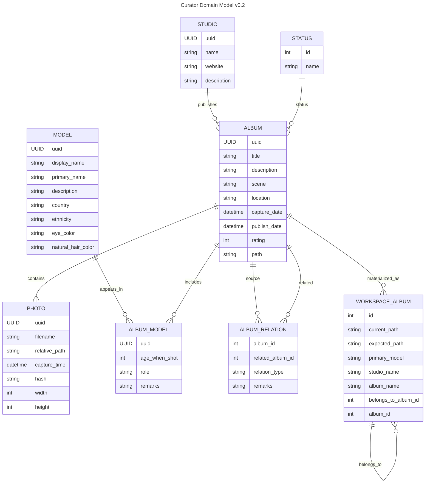

# Curator Domain Model

## Domain Rules

- `album.path` is the permanent Album’s single canonical filesystem path. The permanent Album has no `current_path` or `expected_path` fields.
- `workspace_album` is temporary and may maintain both `current_path` and `expected_path` while processing is incomplete.
- `album_relation` represents an Album-to-Album relationship. For `BELONGS_TO`, `album_id` is a separately released part and `related_album_id` is its logical/canonical Album.
- A default/self relationship is implicit: do not store an `album_relation` row when both sides would be the same Album.
- `workspace_album.belongs_to_album_id` points to `workspace_album.id`. It must be translated to permanent Album IDs through `workspace_album.album_id` during migration.
