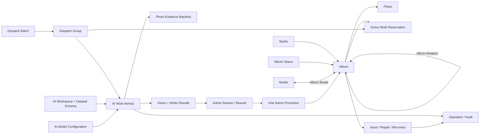

# Curator Database Domain Model

> Documentation status: Current
> Owner: Database
> Last verified: 2026-08-11

## Current domain relationships

```mermaid
flowchart LR
    STUDIO["Studio"] --> ALBUM["Album"]
    STATUS["Album Status"] --> ALBUM
    MODEL["Model"] <-->|"Album Model"| ALBUM
    ALBUM <-->|"Album Relation"| ALBUM
    ALBUM --> PHOTO["Photo"]

    ALBUM --> RESERVATION["Active Work Reservation"]
    BATCH["Dispatch Batch"] --> GROUP["Dispatch Group"]
    GROUP --> RESERVATION
    GROUP --> ITEM["AI Work Item(s)"]

    WORKSPACE["AI Workspace + Dataset Schema"] --> ITEM
    CONFIG["AI Model Configuration"] --> ITEM
    ITEM --> EVIDENCE["Photo Evidence Manifest"]
    ITEM --> RESULT["Vision + Writer Results"]
    RESULT --> REVIEW["Admin Review / Rework"]
    REVIEW --> PROMOTION["One Name Promotion"]
    PROMOTION --> ALBUM

    ITEM --> OPERATION["Operation / Audit"]
    ALBUM --> ISSUE["Issue / Repair / Recovery"]
    ISSUE --> OPERATION
```

This is a conceptual map. Physical tables, FKs, polymorphic links, claims, and
indexes are documented in the [Database Model](Curator_Database_Model.md) and
[Schema Catalog](Schema-Catalog.md).

## Domain boundaries

| Concept | Current meaning |
| --- | --- |
| Album | apps.web management aggregate and Worker scheduling unit |
| Photo | Album-owned file asset and AI evidence source; not general apps.web browse surface |
| Album Status | Durable business classification only |
| Reservation | One active cross-Worker lock for an Album |
| Dispatch Group | Durable assignment/history container for one Album |
| AI Work Item | One model-configuration execution unit inside a Group |
| Manifest | Immutable Backend-selected Photo evidence identity |
| Result stages | Immutable Vision then Writer outputs with current-state projection |
| Review | Human decision/evaluation projection plus immutable decision history |
| Rework | New successor Work Item with preserved lineage/configuration |
| Promotion | Separate reviewed mutation selecting the one winning Album name |
| Operation | Durable audit, traceability, error, and recovery context |
| Historical Workspace Album | Retired materialization model; no active access |

## State separation

An Album can retain one business Status while these independent states change:

- Dispatch Batch/Group/Reservation state;
- Work Item run/lease/attempt state;
- Vision/Writer result stage state;
- Admin review and rework state;
- Promotion outcome;
- Issue, Repair, Quarantine, or Restore state.

No client should infer one state from another unless an approved Specification
defines the transition.

## Evidence and retention

Model configuration snapshot, Manifest, evidence Photo identities, result
payloads/hashes, Attempts, review decisions, rework lineage, Promotion outcome,
Group closure, Workspace retention, and Operations preserve why a change was
recommended and approved. Releasing a Reservation or archiving a Workspace does
not erase this evidence.

## Lifecycle classification

- **Current:** all concepts in the map above.
- **Approved but blocked:** Digital Asset Trash and permanent purge.
- **Historical:** `workspace_album` staging/materialization.
- **Future/Memo:** native Photo curation, self-organized Albums, generic Asset
  types, Annotations, embeddings, semantic similarity, and face clusters.

The physical schema must not be extended from a Future concept without an
approved Architecture/Specification and owning implementation task.
