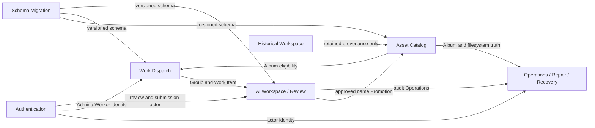

# Database Domain Overview

> Documentation status: Current
> Owner: Database
> Last verified: 2026-08-11

Solid arrows show active data/workflow dependencies. The dotted Historical
edge is provenance only; it does not expose an active Workspace client surface.
