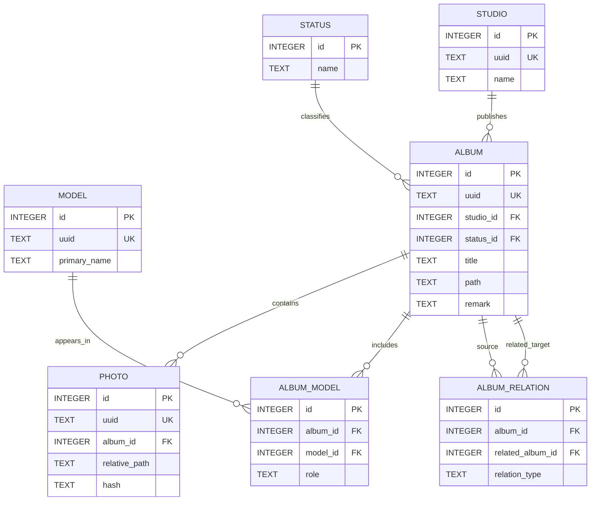

# Asset Catalog ER Model

> Documentation status: Current
> Owner: Database
> Last verified: 2026-08-11

`album.path` is the canonical permanent path. `BELONGS_TO` relates a separately
released Album to its logical Album; self-relations are invalid. Exact FK and
uniqueness authority is recorded in the Schema Catalog because the deployed
base schema still awaits BT-059 canonical bootstrap consolidation.
