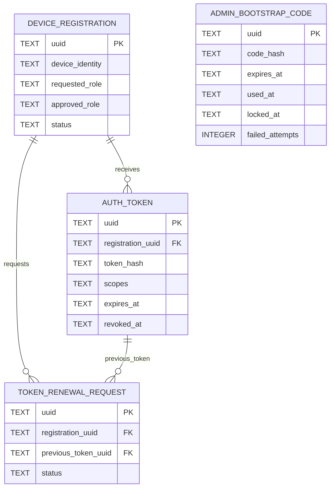

# Authentication ER Model

> Documentation status: Current
> Owner: Database
> Last verified: 2026-08-11

Bootstrap Code consumption creates the first approved Admin identity but is not
a permanent FK relationship. Plaintext Tokens and Bootstrap Codes are never
stored. Last-Admin safety, role transitions, expiry, and one-time disclosure are
Service/API rules backed by tests rather than simple ER cardinality.
