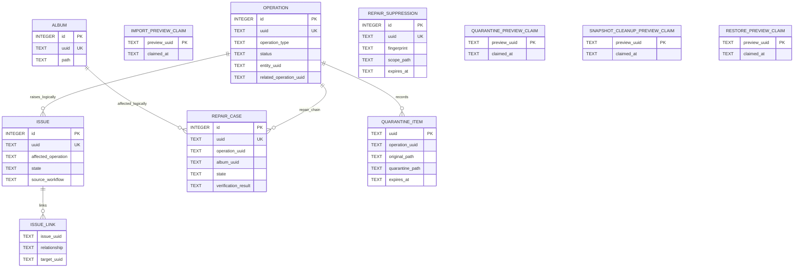

# Operations, Repair, and Recovery ER Model

> Documentation status: Current
> Owner: Database
> Last verified: 2026-08-11

Several edges are logical UUID links rather than physical SQLite FKs. Preview
claim tables are single-use execution bindings. Snapshot files themselves live
in Backend-controlled filesystem storage and therefore have no Snapshot entity
in this ER diagram.
