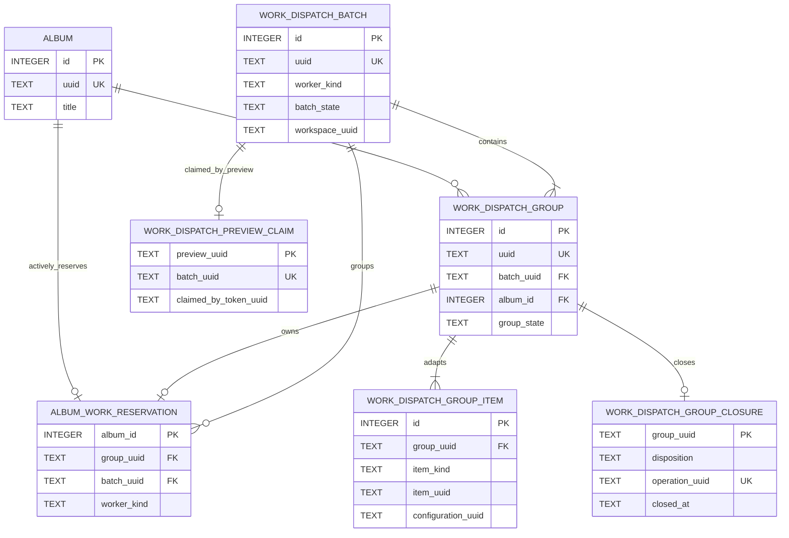

# Work Dispatch ER Model

> Documentation status: Current
> Owner: Database
> Last verified: 2026-08-11

The Reservation row is the active cross-Worker lock and is deleted on release.
Batch, Group, Item links, and Closure remain as history. `item_kind + item_uuid`
is a polymorphic adapter identity; for Album AI work it points to
`workspace_album_ai_worker`, without a physical cross-adapter FK.
