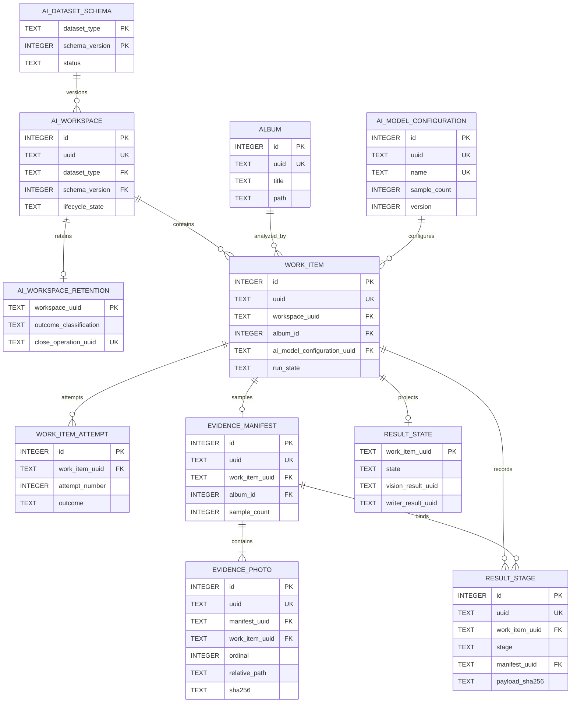
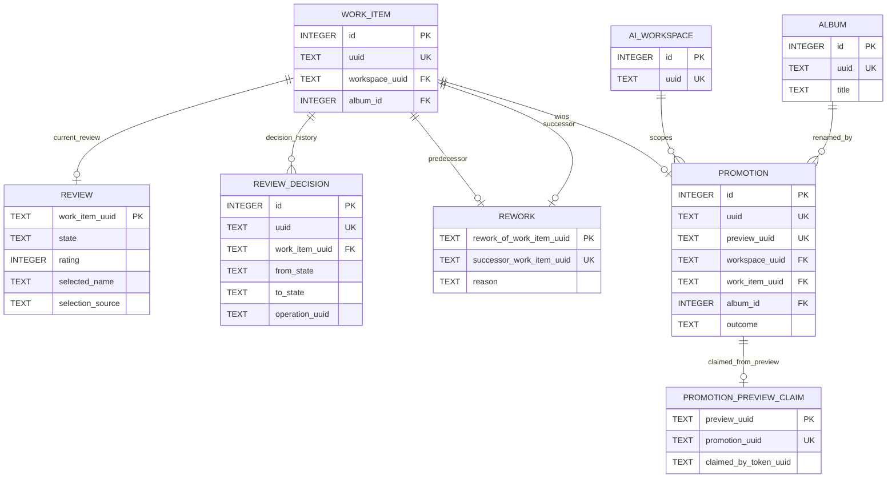

# AI Workspace ER Models

> Documentation status: Current
> Owner: Database
> Last verified: 2026-08-11

## Workspace, execution, and evidence

## Review, rework, and Promotion

Review is a mutable projection; decisions are immutable history. Rework creates
a new Work Item and retains lineage. Partial unique indexes—not Mermaid
cardinality alone—enforce at most one successful Promotion per Workspace+Album
and per winning Work Item.
